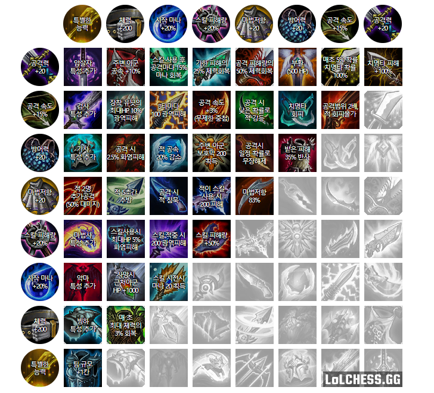

# 유닛 조합식

## 귀 족

**6귀족 4정찰대** (가렌 피오라 베인 루시안 레오나 케일 + 애쉬 킨드 바루스)

**6귀족 2빙하 2수호자** (가렌 피오라 베인 루시안 레오나 케일 + 애쉬 브라움 + @)

**6귀족 2제국** (가렌 피오라 베인 루시안 레오나 케일 + 다리or스웨인 드레이븐 + @)

**6귀족 2정찰대 유령** ( 가렌 피오라 베인 루시안 레오나 케일 + 모데 킨드+ @)

## 야 생 

**4야생 4정찰대** (워윅 니달리 나르 렝가or아리 + 베인 킨드 바루스 애쉬 + @)

**4야생 3형변 4제국** (워윅 니달리 나르 렝가or아리 + 스웨인 카타리나 드레이븐 다리우스 + @)

**4야생 3형변 3메이지 2제국 용**( 워윅 니달리 나르 아리 + 스웨인 드레이븐 + 솔 룰루 + 쉬바나)

**4야생 3메이지 6요들** ( 워윅 니달리 나르 아리 + 베이가 뽀삐 케넨 룰루 트리스타나) - **비추** ( 요들 먼저 맞추는게 개힘듬)

**4야생 2총잡이 3요들 3메이지**( 워윅 니달리 나르 아리 + 트리스타나 루시안 + 룰루 솔 + @ )

## 원소술사

**3원소 4메이지 3요들 2악마 용** ( 케넨 브랜드 리산or애니비아 + 모르가나 룰루 베이가 솔 + 쉬바나 + @)

**3원소 6메이지** ( 케넨 브랜드 리산or애니비아 + 모르가나 룰루 베이가 솔 아리 카사딘 ) - **비추** (용발 나오면 망함)

**3원소 3형변 2제국 용** ( 리산 케넨 브랜드or애니비아 + 스웨인 나르 쉬바나 + 드레이븐 + 솔 + @ )

## 암살자

**6살자 4닌자** ( 제드 카직스 파이크 이블린or렝가 카타 아칼리 + 쉔 케넨 + @ )

**살자 3해적 2총잡이** ( 이블린 카직스 파이크 제드or렝가 카타 아칼리 +  그브 갱플 + @)

**6살자 4야생** (렝가 카직스 파이크 이블린or제드 카타 아칼리 + 나르 니달리 워윅 ) - 암살자 조합 중 **비추** 쓰긴 씀

**6살자 1닌자 3공허** ( 제드or렝가 카직스 파이크 이블린 카타 아칼리 + 초가스 렉사이 + @) 

## 총잡이

**4총잡이 3공허 3해적 3암살자**( 그브 갱플 루시안or미포 트리스타나 + 카직스 초가스 렉사이 + 파이크 아칼리) 
> 초반에 파이크를 넣어서 빠른 3해적이 가능하고 공허해적총잡이 맞춘후 암살자 가능 - 파이크 쓴다고 팔지말고 창고창 체우지말고 빠르게 순환 (암살자 넣는거는 하드모드)

**4총잡이 3검사 2제국** ( 그브 갱플 루시안or미포 트리스타나 + 쉔or야스오 드븐 + 스웨인 + @@)

**4총잡이 3해적 4제국 3검사** ( 그브 갱플 미포 루시안or트리스타나 + 스웨인 드븐 다리우스 카타 + 야스오 )
> 이것도 파이크 순환법

## 빙 하 (  4빙하 추천 6빙하 하면 찾기도 힘들고 시너지 더 낼수 있는것도 못냄)

**6빙하 3원소 2수호자**( 리산 브라움 애쉬 볼리베어 세주아니 애니비아 + 케넨or브렌드 + 레오나 + @@) 
> 애니비아 찾기 힘들어서 그냥 4빙하 추천 **비추**

**4빙하 4정찰대 수호자 유령** ( 브라움 애쉬 볼리베어 세주아니  + 킨드 베인 바루스 + 레오나 + 모데) 

> ( 8코에서 수호자 or 유령 고민 )
**4빙하 3공허 2정찰대** ( 브라움 애쉬 볼리베어 세주아니 + 카사딘or카직스 렉사이 초가스 + 킨드(생존기) + @ )

**4빙하 3원소 2정찰대** ( 브라움 애쉬 리산or애니비아  세주아니 + 케넨 브렌드 + 킨드 + @@)

## 마법사 (6메이지만 쓰는데 왠만하면 서브로 용발 때문에 비추)

**6메이지 용 3요들** (카사딘 룰루 아리or카서스 모르가나 베이가 솔 + 쉬바나 + 나르or뽀삐 + @ ) 

**6메이지 2유령 3요들** ( 카사딘 룰루 아리or카서스 모르가나 베이가 솔 + 모데or카서스 킨드 + 나르 )

-6메이지이지만 유령으로 용 체력 깎고 시작해서 잡을수도 있음(물론 템차이)

___

# 아이템 조합식

## S - 아이템 하나로 게임의 승패에 결정적 영향을 끼침.

**쇼진의 창** : 후반 주요스킬 난사의 주범룰루, 케일, 아우솔 등 스킬이 강력하고 즉발일수록 좋음. 중첩이 가능해 구인수&대천사 + 2쇼진이 이상적인 구성.

**구인수의 격노검** : 원딜 캐리의 핵심 아이템. 주력 원딜이 들고있느냐 없느냐로 게임 승패가 갈림.

## A - 아이템 하나로 게임의 승패에 영향을 끼침.

**대천사의 포옹** : 첫스킬 사용의 핵심. 스킬이 중요한 챔피언일수록 좋음.

**신성의 검** : 원딜의 캐리력에 힘을 실어줌.어느정도 구인수를 대체함.

**대자연의 힘** : 핵심 시너지나 광역 c.c기 자리를 낼 수록 좋다. 슬롯 늘리고 쓸것이 없다면 블리츠크랭크 1성을 넣을것.

## B - 존재감이 확실함. 

**피바라기** : 이거 없으면 원딜이 마법에 터져서 마법사를 못이긴다.

**무한의 대검** : 원딜의 캐리력 증가.하지만 기본 치명타 확률에 의지해야 해서 아쉽다. 신성의 검과 조합시 캐리력 더욱 상승.신성의 검 + 구인수의 격노검 + 무한의 대검 = 극한의 딜조합3성원딜 + 킨드레드 조합에서 쓸만한 딜템 구성.

**고속연사포** : 원딜의 캐리력 증가.사거리가 짧은 원딜일수록 좋고특히 4총잡이 조합에 좋다.

**유령무희** : 원딜의 생존력 증가.3성 원딜한테 들려주면 암살자한테 안죽는다.

**용의 발톱** : 사실상 마법 면역으로 만들어준다.

**모렐로노미콘** : 광역 스킬과 같이 쓰면 광역 치유감소가 굉장히 좋다.

**루덴의 메아리** : 아칼리처럼 스킬을 자주 쓸 수록 좋다.

**라바돈의 죽음모자** : 스킬딜 +90%로 사실상 거의 2배.

**지크의 전령** : 원딜을 많이 쓸수록, 중첩시킬수록 좋다.가장 좋은 경우는 4야생 3지크 조합.

## C - 어느정도 존재감이 있음. 

**저주받은 칼날** : 그레이브즈가 쓰면 상당히 쓸만해진다. 템성능은 나쁘지 않으나, 다른 곡궁템이 너무 좋다.

**얼어붙은 심장** : 나르가 쓰면 A급 아이템.의외로 스킬딜 암살자한테 어울리는 아이템이다. 어차피 탱커들은 맞아서 마나를 채워 스킬을 쓰기 떄문에앞라인한테 들려줘봐야 큰 효과를 보기 어렵다. 상대 딜러에게 붙는 암살자그중에서도 스킬이 중요한 카타리나가 가장 쓰기 좋다.

**강철의 솔라리 팬던트** : 사슬조끼 상위 아이템중 단연코 좋은편이지만 지팡이가 아까울 때가 많다. 붙어있는 아군에 버프를 주는식이라탱커들보다는 리산드라같은 원딜중 앞쪽 포지션 잡는 챔피언이 드는 편이 좋다.

**서풍** : 탱커 아이템중 굉장히 준수한 옵션.만드는 변수도 뛰어나다.서풍으로 떠있는 동안은 없는것으로 취급되어옆에 챔피언이 따로 있다면카직스의 고립딜이 들어간다.

## D - 단점이 있거나 존재감이 약함. 

**침묵** : 광역 C.C기 탱커싸움에서 유용하다. 마나로 아군 탱커의 스킬은 빠르게, 침묵으로 상대 탱커의 스킬 활용은 막는다. 하지만 어디까지나 확률이라 확실치 않아 애매한 아이템.

**거대한 히드라** : 탱커한테는 줘봐야 곡궁이 아깝고원딜들은 체력이 낮아 유의미한 딜이 안나온다. 3성 원딜이 그나마 쓸만하고, 형상변환 조합에서는 A급의 준수한 딜링을 보여준다.

**루난의 허리케인** : 딜링보다는 마나를 빨리 채우는 용도가 더욱 적합하다. 대신 맞는 상대도 마나가 빨리 차기 때문에아우렐리온 솔같은 중요한 아군 스킬 원딜에게 들려주자. 레드버프 등 모든 평타 추가효과를 받지 않는다.

**가시 갑옷** : 3성 피가 많은 탱커에게 들려주면 상대 1~2성 원딜이탱커를 치다가 죽는 모습을 볼 수 있다.

**스태틱의 단검** : 괜찮은 아이템이다.단지 여눈이든 곡궁이든좋은 상위템들이 널렸는데 만들 가치는 없다.

**워모그의 갑옷** : 3성이나 형상변환 탱커에게 좋은 아이템.상대가 레드나 모렐로가 없다면 쏠쏠한 탱킹을 보여준다.

**수호천사** : 살아날때쯤 싸움이 끝나는것이 문제. 인공지능이 치던걸 계속 치려고 하기 때문에 탱커가 살아나봐야이미 우리딜러는 맞고있고 딜러가 죽고 탱커는 할게 없다. 가장 쓸만한 사용법은 암살자 캐리한테 들려주는것. 어그로 빠지고 부활해서 딜을 괜찮게 넣어준다.

**마법공학 총검** : 카타리나에게 상당히 좋지만다른 좋은템이 널렸는데 굳이 만들고 싶지는 않다. 광역딜 감소 패널티가 없는것은 확실한 장점.

**이온 충격기** : 나쁘진 않다. 합치는건 역시 아깝다.

## F - 존재감이 약함. 

**파쇄검** : 평타만 못치게 무장해제를 거는데 사실상 딜러를 쳐서 거는것이 아니면 아무 의미가 없다. 탱커들은 중후반부턴 탱&스킬셔틀이지 평타는 아무 의미가 없기 때문. 평타를 막아도 맞아서 차는 마나로 스킬은 다 쓴다. 암살자한테 들려주는 방법이 있지만그나마도 암살자가 들어가서 상대 딜러를 때린다는 보장이 없으며, 원딜이나 탱커에게 들려줘봐야 방마방 이상의 가치를 보기 힘들다.

**레드 버프** : 평타에만 적용되서 한 대상밖에 못거는것이 너무나도 치명적이다. 이는 그레이브즈를 쓰거나 4총잡이로 사용하는걸로 커버가 가능하긴 하다.후반 전령 등 강력한 몬스터를 잡는데도 쓸만하다.

**구원** : 일찍 터지면 차는 애가 적고, 늦게 터지면 받는 애가 적다. 포커싱당해도 스킬 쓰고 가는광역 C.C기 탱커에게 들려주고 전방배치하는것이 최선이다.

## 쓸만한 아이템 정리

**BF 상위** - 지크, 쇼진, 피바라기, 신성의 검, 무한의 대검

**곡궁 상위** - 구인수, 유령무희, 고속연사포

**갑옷 상위** - 솔라리, 가시갑옷, 유령무희

**망토 상위** - 서풍, 용의 발톱, 피바라기

**지팡이 상위** - 모렐로, 루덴, 라바돈, 구인수

**여눈 상위** - 대천사, 쇼진

**벨트 상위** - 지크, 워모그, 서풍, 루덴

## ? 등급 외 - 얼마나 시너지를 잘쓰느냐에 달려있음.

**요우무의 유령검**

**몰락한 왕의 검**

**기사의 맹세**

**유미**

**다르킨**

**얼어붙은 망치**

### 참고

[한동숙 투게더 '징어요'님](https://tgd.kr/26262948)

[인벤 '별길잡이'님](http://www.inven.co.kr/board/lol/2766/47646)