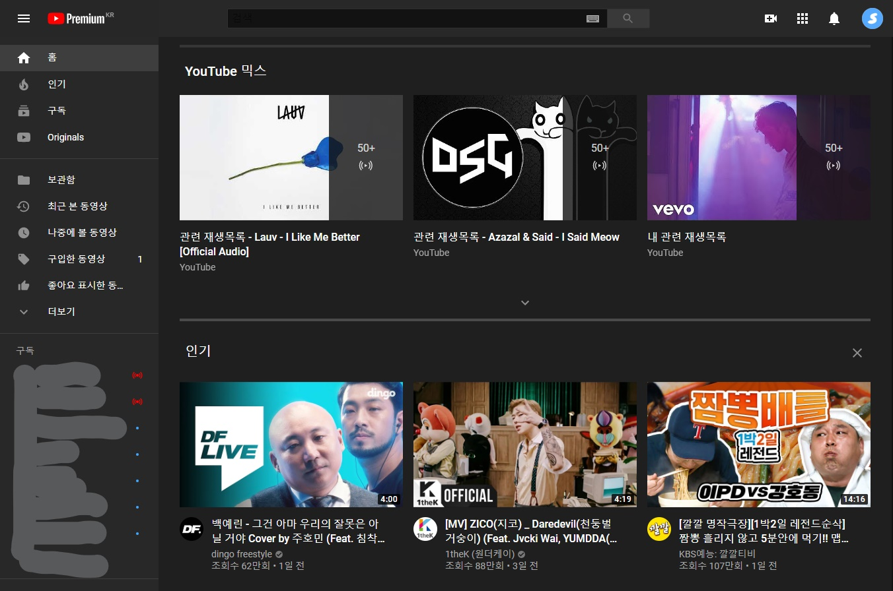
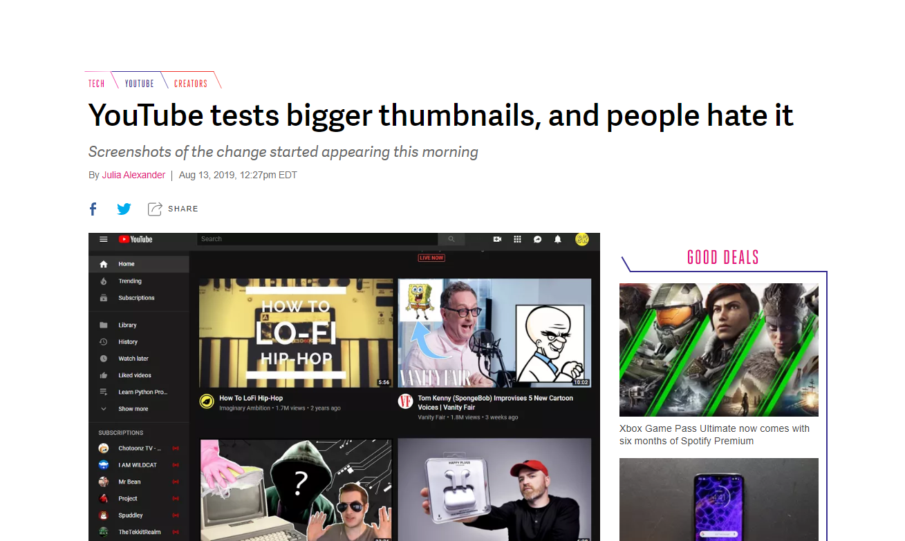

요즘 이런식으로 유튜브의 썸네일이 갑자기 커진 분들이 많나봐요. 저도 갑자기 이런 문제가 생겨서 검색을 해보았는데 질문만 있고 답은 없는 ㅋㅋ.. 결국 영어로 검색을 해보고 답을 찾아냈습니다.

영어권에서도 이 이슈가 아주 난리였습니다.

결론부터 말씀드리면 정상적인 방법으로 되돌리는 방법은 없는 것 같습니다. 유튜브는 영구적으로 썸네일을 크게 만드는 실험을 하고있고, 일부 소수의 유튜브 사용자들을 대상으로 실험하고 있다고 합니다.

YouTube의 일부 제작자는 모바일에서 영감을 얻은 디자인이라고 말합니다. YouTube의 모바일 앱은 더 큰 미리보기 이미지를 사용하여 이미지를 더 잘 보이게 하기 때문이죠. 하지만 문제는 데스크탑에서 볼 때는 모든게 잘 어우러지지 않고 어수선 해 보인다는 것입니다.

만약 어떻게든 원래의 디자인으로 유튜브를 사용하고 싶다면 

<https://www.youtube.com/?disable_polymer=1/>

이 주소로 접속하면 됩니다. (다크모드는 지원 X) 

추가로 쿠키, 캐시를 지우고 다시 접속한다고 해도 문제가 생긴 계정으로 접속하게 되면 그대로라고 합니다.

