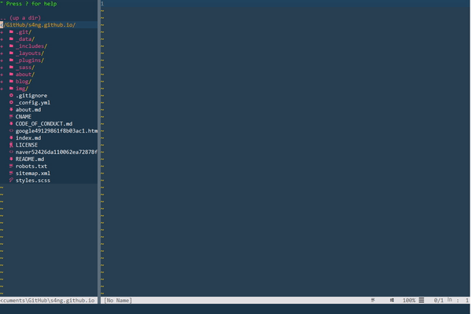

*nvim-qt 실행장면*

```
"===================PlugIn ====================
call plug#begin('~/AppData/Local/nvim/plugged')
Plug 'Raimondi/delimitMate'
Plug 'vim-airline/vim-airline'
Plug 'vim-airline/vim-airline-themes'
Plug 'skywind3000/asyncrun.vim'
Plug 'scrooloose/nerdtree'
Plug 'ryanoasis/vim-devicons'
Plug 'herrbischoff/cobalt2.vim'
Plug 'dense-analysis/ale'
Plug 'mxw/vim-jsx'
Plug 'pangloss/vim-javascript'
call plug#end()
" ============================================

"==================Plugin Setting=================
" open quickfix window automatically when AsyncRun is executed
" set the quickfix window 6 lines height.
let g:asyncrun_open = 6

" ring the bell to notify you job finished
let g:asyncrun_bell = 1

" F10 to toggle quickfix window
nnoremap <F10> :call asyncrun#quickfix_toggle(6)<cr>

let g:airline_theme='papercolor'

let NERDTreeShowHidden=1
let NERDTreeDirArrows = 1
autocmd vimenter * NERDTree
autocmd bufenter * if (winnr("$") == 1 && exists("b:NERDTree") && b:NERDTree.isTabTree()) | q | endif

let g:delimitMate_autoclose = 1
let g:delimitMate_matchpairs = "(:),[:],{:},<:>"
let g:delimitMate_jump_expansion = 1
let g:delimitMate_expand_space = 1
let g:delimitMate_expand_cr = 2
let g:delimitMate_expand_inside_quotes = 1

"=================Key Settings ====================
inoremap jj <Esc>

"Save
nnoremap <silent> <C-S> :w<cr>

if has("autocmd")
  augroup vimrcCompileMap
    " Remove ALL autocommands for the current group. This prevents having the
    " autocommands defined twice (e.g., after sourcing the .vimrc file again).
    autocmd!

    autocmd FileType c noremap <silent> <F4> :AsyncRun gcc -Wall -O2 "$(VIM_FILEPATH)" -o "$(VIM_FILEDIR)/$(VIM_FILENOEXT)" <cr>
    autocmd FileType c noremap <silent> <F5> :AsyncRun -raw -cwd=$(VIM_FILEDIR) -mode=4 "$(VIM_FILEDIR)/$(VIM_FILENOEXT)" <cr>
    autocmd FileType cpp noremap <silent> <F4> :AsyncRun g++ -Wall -O2 "$(VIM_FILEPATH)" -o "$(VIM_FILEDIR)/$(VIM_FILENOEXT)" <cr>
    autocmd FileType cpp noremap <silent> <F5> :AsyncRun -raw -cwd=$(VIM_FILEDIR) -mode=4 "$(VIM_FILEDIR)/$(VIM_FILENOEXT)" <cr>
    autocmd FileType python map <F5> :AsyncRun -mode=4 -raw python % <cr>
    autocmd FileType javascript map <F5> :AsyncRun -mode=4 -raw node % <cr>

  augroup END
endif

inoremap {<CR> {<CR>} <C-o>O

"===============ale linter=====================

let g:ale_lint_on_save = 1              "Lint when saving a file
let g:ale_sign_error = '✖'                                                      "Lint error sign
let g:ale_sign_warning = '⚠'                                                    "Lint warning sign
let g:ale_statusline_format =[' %d E ', ' %d W ', '']                           "Status line texts
"let g:ale_linters = {'javascript': ['eslint']} 
"let g:ale_fixers = {'javascript': ['prettier', 'eslint']}  

"=================settings=====================

set clipboard=unnamed
set encoding=UTF-8
set autoindent
set cindent
set smartindent
set tabstop=4
set shiftwidth=4
set number
set ruler
set title
set wrap
set cursorline
set mouse=a
set number relativenumber
set nu rnu

"color scheme setting
colorscheme cobalt2
" =============================================
```


## 플러그인 목록

### Raimondi/delimitMate - 괄호 자동완성 플러그인

Vim을 아무 설정 없이 처음 사용하면 자동으로 괄호를 완성시켜주는 기능이 없어서 불편할 때가 있다. 보통의 IDE를 쓸 때처럼 괄호를 자동으로 완성시켜주는 경험을 할 수 있게해준다.


### vim-airline/vim-airline && vim-airline/vim-airline-themes - 상태확인바 플러그인

Vim 위나 아래에 작업중인 경로나 파일의 상태 등을 확인 할 수 있는 상태바가 생기고 예쁘게 꾸밀 수 있다.


### skywind3000/asyncrun.vim - 비동기 코드 실행 플러그인

Neovim의 새로운 API를 활용해서 백그라운드의 쉘에서 코드를 실행하고 vim 내에서 실시간으로 출력할 수 있다. 알고리즘 문제를 풀 때 처럼 코드를 개별적으로 컴파일하는 상황에 매우 편리한 플러그인이다. 나는 F5를 누르면 Filetype을 체크하고 각각 확장자별로 다른 명령을 매핑하여 사용하고 있다.


### scrooloose/nerdtree - A tree explorer plugin for vim

vim 내에서 다른 IDE처럼 파일을 바로바로 선택할 수 있는 explorer가 있었으면 좋겠다는 생각을 했는데 딱 좋은 플러그인이 있어서 추가하였다.


### ryanoasis/vim-devicons - Nerdtree에 예쁜 아이콘을 붙여주는 플러그인

더 예쁜 Nerdtree!


### herrbischoff/cobalt2.vim - cobalt2 color scheme plugin

내가 제일 좋아하는 코발트2의 Color scheme 플러그인이다.


### dense-analysis/ale - Asynchronous Lint Engine

Vim의 대표 lint 플러그인. 코드 문법을 정해진 규칙에 맞추어 linting(오류검사) 해준다.  


### mxw/vim-jsx && pangloss/vim-javascript - Javascript, React 전용 Syntax highlighting

Javascript와 React용 Syntax highlighting을 해준다. Syntax highlight는 구문 강조라는 뜻으로 코드 형식의 틀에 따라 여러가지 색과 글꼴로 다르게 보여줘서 코드를 예쁘게 꾸며준다.
