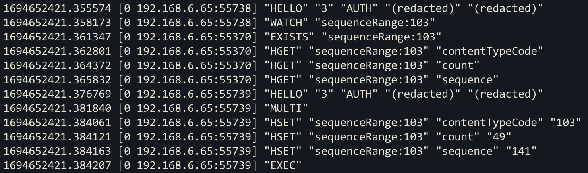
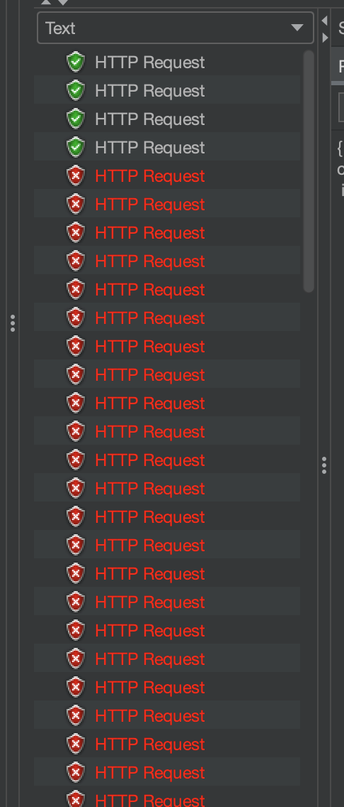
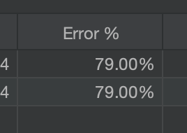
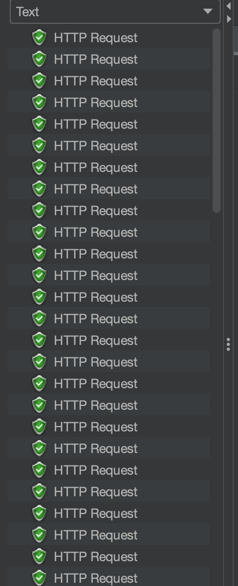
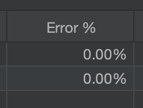

현재 개발중인 프로젝트의 비즈니스 로직 대부분에는 각 요청마다 Log를 적재하는 로직을 포함하고 있다.

이 때 각 로그의 키로 사용되는 log id를 생성하게 되는데, 별도의 테이블에서 해당 로그 테이블에 대한 키로 값을 조회, 저장하는 방식으로 관리하고 있었다.

log id가 필요할 때마다 해당 테이블에서 값을 조회하고, 1을 올려서 다시 저장하는 방식이다.

해당 메서드는 트랜잭션으로 묶여 있었는데, 트랜잭션 격리 수준(isolation)이 Serializable 이었다.

Serializable의 경우 모든 조회(Select) 쿼리에 공유 락을 걸게 되는데, 이 때 2개의 트랜잭션이 동시에 공유 락을 걸게 되면, 두 트랜잭션 모두가 쓰기 작업을 하지 못하게 되기 때문에 데드락이 발생하기 너무나 쉬운 상황이었다.

실제로도 다수의 요청 발생 시 데드락이 많이 발생하고 있었다.

해결 방법으로 log id를 db에서 여러개를 가져와서 메모리에 채워놓고, 실제로 사용할 때는 메모리에서 하나씩 꺼내서 사용하는 방식으로 시도해 보았다.

이 방식을 사용하면 log id가 필요한 상황 대부분에서 메모리만을 조회하게 되고, db 접근이 확연히 줄어들게 되기 때문이다.

어플리케이션이 여러개 뜰 상황을 고려하여 어플리케이션 내의 메모리가 아닌 Redis 데이터베이스를 사용하기로 했다.

## 기본 구조

log id가 필요함 ⇒ redis에 남아있는지 조회 ⇒ 남아있으면 log id를 반환 후 redis에 값 수정 ⇒ 없으면 DB에서 조회 후 redis에 채워놓음

기능을 모두 구현했으나, 동시성 문제가 남아있었다.

Redis는 싱글 스레드 이벤트 루프 방식으로 동작하기 때문에, 각각의 쿼리(Operation)는 스레드 안전하게 동작한다. 

하지만 여러 요청을 하나의 트랜잭션으로 보내게 될 경우 별도의 처리를 해주지 않으면 쿼리 사이에 다른 트랜잭션이 침입해서 독립성을 침해할 수 있다.

우리의 경우 log id를 조회(1)하고 값을 변경 후 저장(2)하는 두 Operation 사이에 다른 트랜잭션이 끼어들 수도 있다는 것이 문제였다.

## Synchronized 사용

여러 스레드가 log id를 가져오는 메서드를 호출할 때 synchronized를 사용하는 것 만으로도 손쉽게 스레드 동기화를 적용할 수 있다.

하지만 어플리케이션이 여러개 뜰 경우에는 소용이 없기 때문에 다른 방법을 시도하였다.

## Redis Multi/Exec 사용

Redis는 트랜잭션 처리를 위해 multi/exec 커맨드를 제공한다.

multi, exec 커맨드 사이에 다른 커맨드를 포함해서 보내면, Redis는 큐에 커맨드들을 넣은 뒤 한꺼번에 요청해서 트랜잭션의 독립성을 지킨다.

이 때 watch 커맨드를 사용해 특정 키에 낙관적 락을 걸 수 있는데, watch 커맨드 후 exec 커맨드가 들어올 때 까지 해당 키의 값이 변경되면 트랜잭션이 실패하는 식이다.

watch로 인해 트랜잭션이 실패하면 discard 커맨드를 사용해 롤백시킬 수 있다.



Spring data redis를 활용해서 multi/exec을 적용하는 방법은 2가지가 있는데,

첫 번째로는 @Transactional 어노테이션을 활용하는 방법과, RestTemplate.execute()를 사용하는 방법이 있다.

결론부터 말하자면 Transactional 어노테이션을 사용하면 watch 커맨드를 사용할 수 없고, RestTemplate를 사용하면 watch 커맨드를 사용하는데 제약이 많다.

기본적으로 watch 커맨드는 한 세션 안에서 exec 명령어를 사용해야 낙관적 락이 적용되는데, RestTemplate.execute()는 매개변수로 넘겨주는 콜백 메서드 안에서만 사용해야 한 세션으로 적용가능하다.

따라서 해당 메서드 바깥에서 watch 커맨드를 통해 낙관적 락을 적용하고 싶어도 그렇게 할 수가 없다.

또한 낙관적 락의 특성상 동시에 같은 데이터를 수정하면 한 트랜잭션 이외의 다른 트랜잭션은 모두 실패하기 때문에 좋은 해결 방법이 아니라고 판단했다.

## Redis 스핀 락 직접 구현

Redis의 해당 log id의 키에 접근하려고 할 때 락을 획득해야 접근이 가능하도록 하였다.

예를 들어 sequence:100 키의 데이터를 조회하려고 한다면 sequenceLock:100 키의 데이터(락)를 생성하고, 만약 해당 키에 값이 이미 있다면 스핀(반복문)을 통해 락 획득을 대기하도록 하는 방식이다.

하지만 스핀 락을 획득하려고 할 때 반복문으로 Redis에 계속 요청을 하기 때문에 부하가 심하다는 문제점이 있다.

또한 결과적으로 성능 테스트 시 10개 스레드로 동시 요청할 경우 5개 정도는 락을 획득하지 못해 요청이 실패하였다.

(지금 생각해보니 대기 시간을 너무 작게 준 것 때문에 실패한 듯 하다. (총 310 밀리초 대기. 즉 0.31초))

```java
// 락 획득 메서드
public void lock( ContentTypes contentType ) {

	ValueOperations< String, Object > valueOps = redisTemplate.opsForValue();
	String key = SEQUENCE_LOCK_KEY_PREFIX + contentType.getCode();
	String requestId = MDC.get( MDCKeys.REQUEST_ID );
	int retryCount = 5;
	int delay = 10;
	for ( int i = 0; i < retryCount; i++ ) {

		// 현재 key에 대한 값이 존재하지 않으면 값을 생성(락 획득)
		if ( valueOps.get( key ) == null ) {
			valueOps.set( key, requestId );
			redisTemplate.expire( key, 5, TimeUnit.SECONDS );
			return;
		// key에 대한 값이 이미 있다면 누군가 락을 점유중이라는 의미
		} else {
			try {
				Thread.sleep( delay << i );
			} catch ( InterruptedException e ) {
				Thread.currentThread().interrupt();
				throw new RuntimeException( e );
			}
		}
	}
	throw VaultServerException.builder()
			.type( VaultServerExceptions.GENERATOR_REDIS_CANNOT_GET_LOCK )
			.build();
}

// 락 해제 (해당 키 값의 데이터 제거)
public void unlock( ContentTypes contentType ) {

	String key = SEQUENCE_LOCK_KEY_PREFIX + contentType.getCode();

	if ( Boolean.TRUE.equals( redisTemplate.hasKey( key ) ) ) {
		redisTemplate.delete( key );
	}
}
```

## Redisson의 tryLock을 활용한 분산 락

Spring에서 Redis를 사용하는 라이브러리는 여러가지 종류가 있는데, 그 중 Spring-boot-starter-redis 라이브러리의 기본 제공 라이브러리는 Lettuce이다.

이전에 스핀락을 구현했었던 라이브러리도 Lettuce였다. 하지만 Redisson이라는 라이브러리를 사용하면 내부적으로 락이 구현되어 있어 편하고 좋은 성능으로 사용할 수 있다고 하여 사용해보았다.

Redisson의 락은 Redis의 pub/sub을 활용하여 구현되어있는데, 기본적으로 락을 대기하는 스레드들은 모두 그 키에 대한 채널을 구독(Subscribe)하고 있다가, 락을 획득한 스레드가 락을 모두 사용하여 반환하면 그 채널에 락 반환 사실을 Publish 하여 락 대기자들에게 신호를 보내주는 방식이다.

기존에 스핀 락 형태로 구현하였을 때보다 Redis에 대한 부하가 훨씬 덜하고, 코드도 훨씬 보기 좋아졌다는 장점이 있다.

```java
String key = SEQUENCE_LOCK_KEY_PREFIX + contentType.getCode();
// Redis 락 객체 생성
RLock lock = redissonClient.getLock( key );

try {
	// 락 요청 (락 획득 혹은 Subscribe, 30초 대기, 5초 점유)
	boolean isLocked = lock.tryLock( 30, 5, TimeUnit.SECONDS );
	if ( !isLocked ) {
		throw CustomException.builder()
				.type( CustomExceptions.GENERATOR_REDIS_CANNOT_GET_LOCK )
				.build();
	}

	// log id 요청 메서드
	return this.getSequenceQueue( contentType, numberOfIds );

} catch ( InterruptedException e ) {
	Thread.currentThread().interrupt();
	throw CustomException.builder()
			.type( CustomExceptions.GENERATOR_REDIS_CANNOT_GET_LOCK )
			.cause( e )
			.build();
} finally {
	// 락 반환 (Publish)
	lock.unlock();
}
```

InterruptException을 catch하고 또 다시 interrupt()를 하는 이유는 [InterruptedException 발생 시 해결방법](https://app.notion.com/p/InterruptedException-eadeb0d636234bc9aafb6b9200140c85?pvs=21) 페이지를 참고

## 성능 테스트 실패

모든 기능을 구현한 뒤 JMeter를 활용하여 100스레드 동시 요청 테스트를 진행해 보았다.

결과는 약 80퍼센트의 에러율을 보였다.





문제는 Connection 풀과 Transactional에 있었다.

Redis를 통해 log id를 가져올 때에는 아무 문제 없이 요청이 성공하다가, Redis에 준비된 log id가 다 떨어졌을 경우에 db에 접근하는 로직에서 문제가 났던 것이다.

모든 요청이 비즈니스 로직에 진입하면 Transactional 어노테이션으로 인한 트랜잭션에 돌입하게 되는데, 이 때 DB Connection pool에서 커넥션을 하나 꺼내 점유하게 된다. 

이후 트랜잭션이 완료되면 커넥션을 커넥션 풀로 반환하고, 다음 요청이 사용하게 되는데,

DB에서 log id를 꺼내와야 하는 메서드의 Transaction propagation 수준이 Requires_new로 설정되어 있던 것이다.

모든 스레드가 커넥션을 점유하고 있는 상황에서, 락을 점유한 스레드가 새로운 커넥션을 열기위해 커넥션이 반환되기를 기다리고 있었다.

또한 그 커넥션을 반환해주어야 할 다른 스레드들은 저 락을 획득하기 위해 대기하게 되고, 곧 데드락이 발생한 것이다.

지금은 해당 DB 로직또한 Redis에서 락을 획득해야 접근할 수 있기 때문에, Transaction의 전파 수준을 Required로 낮추었고 100스레드 동시 요청 테스트가 100퍼센트 성공한 것을 볼 수 있었다.





끝