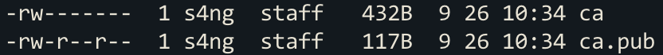
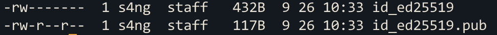

# 개요

기존에 ssh 키로 접속하는 방법은 ssh public key를 접속할 서버의 ~/.ssh/authorize_keys 파일에 등록하고 난 뒤에 private 키를 사용해서 접속하는 방식이었다.

해당 방법을 사용하면 id/password로 접속하는 방법보다는 보안 측면에서 좋을 지 모르겠지만 여러가지 단점이 있다.

우선 매번 새로운 접속자의 public key를 서버에 등록해주어야 한다. 때문에 authorize_keys 파일은 계속해서 커질 것이고, 서버 접속자가 늘어날 때마다 관리자는 피로감을 느낄 수 있다.

두 번째로는 키를 탈취당하는 것이 매우 큰 리스크라는 것이다. 키를 주기적으로 rotate하지 않는다면 계속 접속 권한을 유지하고 있기 때문이다.

이 때문에 CA(인증 기관)을 이용한 ssh 접속 방법을 사용해서 여러 문제점을 해결할 수 있다.

## 실습

Host를 인증받는 방법과 사용자를 인증받는 방법이 있는데, 이 중 사용자를 인증받는 방법만 실습해본다.

### 준비

키 알고리즘은 짧고 편리한 ed25519 알고리즘을 사용한다.

또 원래는 인증서를 사인해줄 별도의 서버가 필요하지만, ssh client 서버에서 CA 서버의 기능까지 함께 테스트 한다.

우선 CA로 사용할 ssh key pair를 생성한다.

```bash
$ cd ~/.ssh/
$ ssh-keygen -t ed25519 -f ca
Generating public/private ed25519 key pair.
Enter passphrase (empty for no passphrase):
Enter same passphrase again:
Your identification has been saved in ca
Your public key has been saved in ca.pub
The key fingerprint is:
SHA256:LXNoNeareSzj5wtpAFwvjtuFTY0XH9WdUBkPDSHyRV4 s4ng@isang-geun-ui-MacBookPro.local
The key's randomart image is:
+--[ED25519 256]--+
|      .   o o+XBE|
|   . . . o = = ==|
|    o . + * o . .|
|     + = B .     |
|    . + S +      |
|     o + = .     |
|    . . +..      |
|       .o++      |
|       .+*o.     |
+----[SHA256]-----+
```



이제 해당 CA를 통해 사인받은 키로 ssh 접속이 가능하도록 접속할 서버에 CA public key를 설정해준다 (1회)

```bash
// ssh로 접속할 서버

cd /etc/ssh
vi trusted_user_ca_keys.pub   // 생성한 파일에 ca.pub 내용을 복사/붙여넣기 한다

vi sshd_config    // sshd config 파일 맨 밑 줄에 추가
                  // TrustedUserCAKeys /etc/ssh/trusted_user_ca_keys.pub
systemctl restart sshd   // sshd를 재시작. 이 부분은 linux 배포판에 따라 달라질 수 있음.
```

이 CA 키는 가장 안전하게 보호되어야 한다.

client에서 ssh 서버로 접속할 때 사용하게 될 ssh key를 생성한다.

```bash
$ cd ~/.ssh/
$ ssh-keygen -t ed25519 -f ./id_ed25519
Generating public/private ed25519 key pair.
Enter passphrase (empty for no passphrase):
Enter same passphrase again:
Your identification has been saved in ./id_ed25519
Your public key has been saved in ./id_ed25519.pub
The key fingerprint is:
SHA256:vcN3+BT8mpHLbEi3Bzmx/PqjS4/6fjA6uUCoLuYwm5A s4ng@isang-geun-ui-MacBookPro.local
The key's randomart image is:
+--[ED25519 256]--+
|                 |
|                 |
|                 |
|        ..   ..  |
|       .S..  .o+ |
| .    . .. ..+B+ |
|Eo   .   .+.=+B=.|
|. =o.     .*o*=Bo|
| oo...     o*B%=o|
+----[SHA256]-----+
```



client의 ssh 퍼블릭 키를 CA를 통해 서명받는다.

```bash
$ cd ~/.ssh
$ ssh-keygen -s ca -I root -n root -V +10m id_ed25519.pub
Signed user key id_ed25519-cert.pub: id "root" serial 0 for root valid from 2023-09-26T10:51:00 to 2023-09-26T11:02:10

$ ll
total 40
-rw-------  1 s4ng  staff   432B  9 26 10:34 ca
-rw-r--r--  1 s4ng  staff   117B  9 26 10:34 ca.pub
-rw-------  1 s4ng  staff   432B  9 26 10:33 id_ed25519
-rw-r--r--  1 s4ng  staff   658B  9 26 10:52 id_ed25519-cert.pub
-rw-r--r--  1 s4ng  staff   117B  9 26 10:33 id_ed25519.pub
```

위 ssh-keygen의 option들을 간단히 설명하면

-s : 서명할때 사용할 ca pri_key를 입력한다.

-I : 인증서 Identifier (보통 사용자 이름, host 도메인 등을 사용)

-n : 접속할 사용자 ID

-V : 인증서 유효 시간 (+10m = 10분 생존)

즉 접속할 client의 public key를 ca로 서명받고, 유효기간을 부여한다는 의미이다.

따라서 인증서를 탈취당해도 유효기간이 지나면 사용할 수 없게된다.

또 ssh-keygen으로 서명하면 자동으로 서명받은 public key 에 -cert가 붙은 이름으로 인증서가 생성된다.

ssh 접속 방법

```bash
$ ssh -i id_ed25519 root@192.168.0.10
// 또는
$ ssh -i id_ed25519 -i id_ed25519-cert.pub root@192.168.0.10

Last login: Tue Sep 26 10:50:46 2023 from 192.168.6.65
[root@localhost ~]#
```

접속하고자 하는 private키만 전달하면 자동으로 인증서 파일까지 포함해 요청하게 된다.

## 정리

CA를 통해 ssh 키를 서명받고 해당 인증서로 ssh 접속을 하게되면 다음과 같은 이점을 얻을 수 있었다.

- 접속할 서버의 authorize_keys 파일에 pub_key를 계속 추가할 필요가 없다.
- 인증서 유효시간을 통해 보안 확립 가능

추가로 HashCorp - Vault를 사용해서도 견고한 CA 인증 서버를 구축할 수 있다.

끝