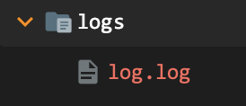
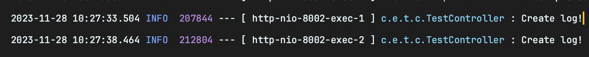
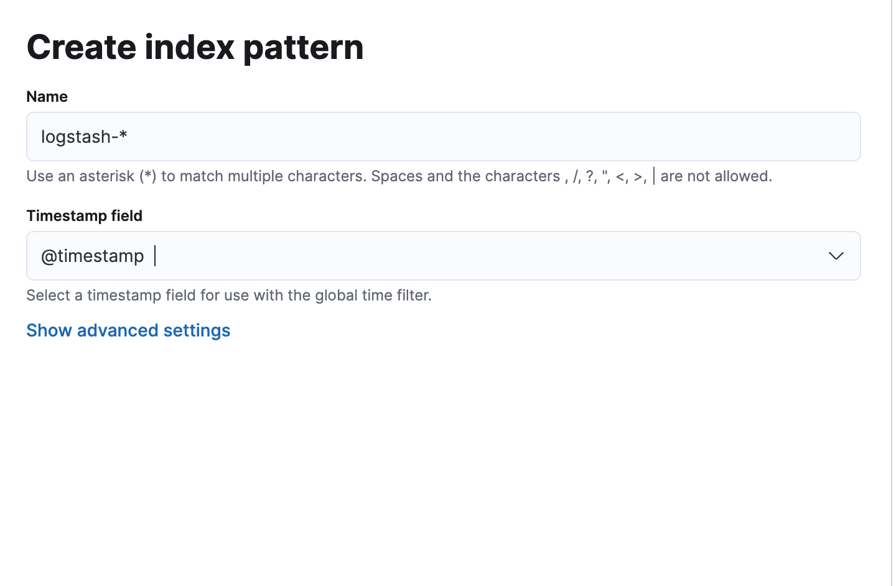
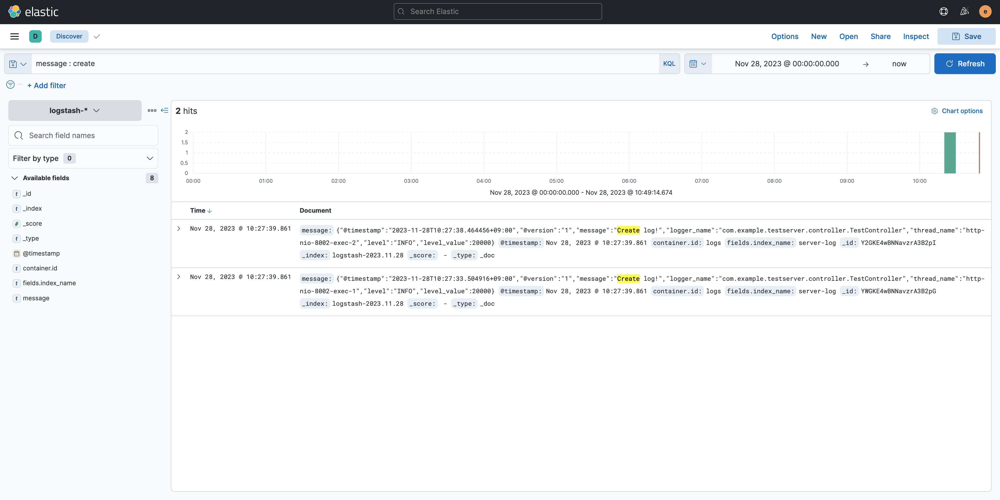

# 개요

Spring boot로 생성된 로그를 Elastic search, Logstash, Kibana, Filebeat를 사용해서 적재하도록 구성.

이중 ELK 스택은 도커를 사용하여 설치한다.

# Spring boot

로그를 생성할 간단한 Controller 생성 

```java
// TestController.kt
@RestController
class TestController {

    private val log = LoggerFactory.getLogger(javaClass)

    @GetMapping("/test")
    fun test() {
        log.info("Create log!")
    }
}
```

Logstash encoder dependency 추가

```java
// build.gradle.kts
...
dependencies {
    implementation("net.logstash.logback:logstash-logback-encoder:7.4")
...
```

src.main.resources 에 logback 설정파일 추가

logback-spring.xml

```xml
<?xml version="1.0" encoding="UTF-8"?>
<configuration>
    <!-- Console 설정 -->
    <property name="CONSOLE_LOG_PATTERN"
              value="%d{yyyy-MM-dd HH:mm:ss.SSS} %highlight(%-5level) %magenta(%-4relative) --- [ %thread{10} ] %cyan(%logger{20}) : %msg%n"/>
    <property name="LOG_PATH" value="./logs"/>
    <property name="FILE_NAME" value="log"/>

    <appender name="CONSOLE" class="ch.qos.logback.core.ConsoleAppender">
        <encoder class="ch.qos.logback.classic.encoder.PatternLayoutEncoder">
            <pattern>${CONSOLE_LOG_PATTERN}</pattern>
        </encoder>
    </appender>

    <!-- Log file 설정 -->
    <appender name="FILE" class="ch.qos.logback.core.rolling.RollingFileAppender">
        <file>${LOG_PATH}/${FILE_NAME}.log</file>
        <encoder class="net.logstash.logback.encoder.LogstashEncoder"/>
        <rollingPolicy class="ch.qos.logback.core.rolling.TimeBasedRollingPolicy">
            <fileNamePattern>${LOG_PATH}/${FILE_NAME}_%d{yyyy-MM-dd}.%i.log</fileNamePattern>
            <maxHistory>90</maxHistory>
            <timeBasedFileNamingAndTriggeringPolicy
                    class="ch.qos.logback.core.rolling.SizeAndTimeBasedFNATP">
                <maxFileSize>10MB</maxFileSize>
            </timeBasedFileNamingAndTriggeringPolicy>
        </rollingPolicy>
    </appender>

    <root level = "INFO">
        <appender-ref ref="FILE"/>
        <appender-ref ref="CONSOLE"/>
    </root>
</configuration>  
```

실행 후 /test 로 GET 요청하여 로그 발생되는지 확인





# ELK

MangKyu/Docker-ELK 레포지토리 클론

```bash
git clone "https://github.com/MangKyu/Docker-ELK"
```

docker-compose.yml 파일 수정 (elasticsearch elastic 계정 비밀번호 변경)

```bash
services:
  elasticsearch:

		...

    environment:
      ELASTIC_PASSWORD: elastic   // <--
```

kibana, logstash 의 elasticsearch 접속 정보를 수정

```yaml
// kibana/config/kibana.yml
...
elasticsearch.username: elastic
elasticsearch.password: elastic
```

```yaml
// logstash/config/logstash.yml
...
xpack.monitoring.elasticsearch.username: elastic
xpack.monitoring.elasticsearch.password: elastic
```

```yaml
// logstash/pipeline/logstash.conf
input {
	beats {
		port => 5044
	}

	tcp {
		port => 5000
    codec => json_lines
	}
}

## Add your filters / logstash plugins configuration here
filter {
        # logInfo의 JSON 데이터를 각 필드로 넣어준다.
        json {
                source => "logInfo"
        }
        # 제거할 필드 설정
        mutate {
                remove_field => ["@version","agent","ecs","host","input","log","tags"]
        }
}

output {
	elasticsearch {
		hosts => "elasticsearch:9200"
		user => "elastic"
		password => "elastic"
		index => "logstash-%{+YYYY.MM.dd}"
	}
}
```

이후 docker compose up -d 명령어를 사용해 ELK 컨테이너를 실행시킨다.

# Filebeat

Spring의 로그를 Logstash로 전송할 Filebeat를 설치한다.

다운로드 링크 : [https://www.elastic.co/kr/downloads/beats/filebeat](https://www.elastic.co/kr/downloads/beats/filebeat)

압축을 해제한 뒤 filebeat.yml 파일을 수정

```yaml
filebeat.inputs:
- type: log

  # Unique ID among all inputs, an ID is required.
  id: client-log

  # Change to true to enable this input configuration.
  enabled: true

  # Paths that should be crawled and fetched. Glob based paths.
  paths:
    - /Users/s4ng/IdeaProjects/test-client/logs/log.log
 
  fields:
    index_name: "client-log"

# ============================== Filebeat modules ==============================

filebeat.config.modules:
  # Glob pattern for configuration loading
  path: ${path.config}/modules.d/*.yml

  # Set to true to enable config reloading
  reload.enabled: false

  # Period on which files under path should be checked for changes
  #reload.period: 10s

# ======================= Elasticsearch template setting =======================

setup.template.settings:
  index.number_of_shards: 1
  #index.codec: best_compression
  #_source.enabled: false
 
# =================================== Kibana ===================================

# Starting with Beats version 6.0.0, the dashboards are loaded via the Kibana API.
# This requires a Kibana endpoint configuration.
setup.kibana:

  # Kibana Host
  # Scheme and port can be left out and will be set to the default (http and 5601)
  # In case you specify and additional path, the scheme is required: http://localhost:5601/path
  # IPv6 addresses should always be defined as: https://[2001:db8::1]:5601
  #host: "localhost:5601"

  # Kibana Space ID
  # ID of the Kibana Space into which the dashboards should be loaded. By default,
  # the Default Space will be used.
  #space.id:
 
# ------------------------------ Logstash Output -------------------------------
output.logstash:
  # The Logstash hosts
  hosts: ["localhost:5044"]

  # Optional SSL. By default is off.
  # List of root certificates for HTTPS server verifications
  #ssl.certificate_authorities: ["/etc/pki/root/ca.pem"]

  # Certificate for SSL client authentication
  #ssl.certificate: "/etc/pki/client/cert.pem"

  # Client Certificate Key
  #ssl.key: "/etc/pki/client/cert.key"

# ================================= Processors =================================
processors:
  - add_host_metadata:
      when.not.contains.tags: forwarded
  - add_cloud_metadata: ~
  - add_docker_metadata: ~
  - add_kubernetes_metadata: ~
```

이후 ./filebeat -e -c filebeat.yml 명령어를 통해 filebeat를 실행시켜준다.

# Kibana

elastic / elastic 계정으로 로그인 하고 나서

Management - Stack Management - Kibana - Index Patterns 로 가서 새로운 Index Pattern을 만들어 준다.



이후 시간이 지나 인덱스가 생성되면 메인 - Discover 에서 해당 인덱스로 적재된 로그를 확인할 수 있게된다.



끝
