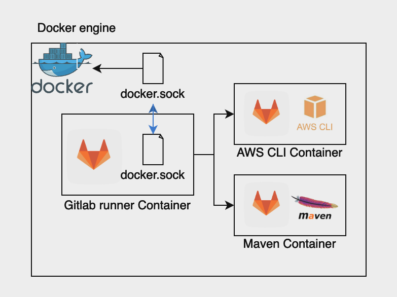
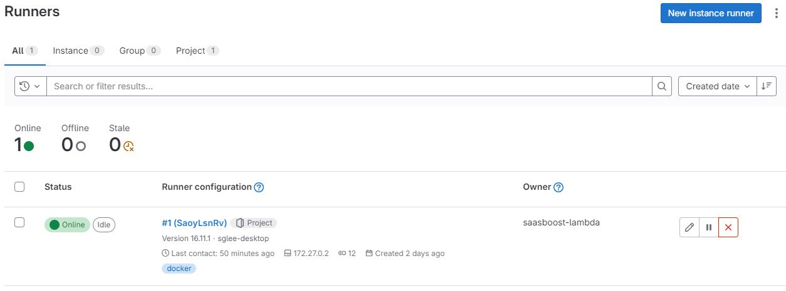
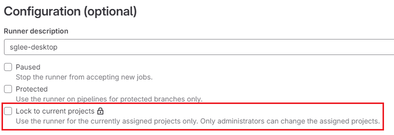
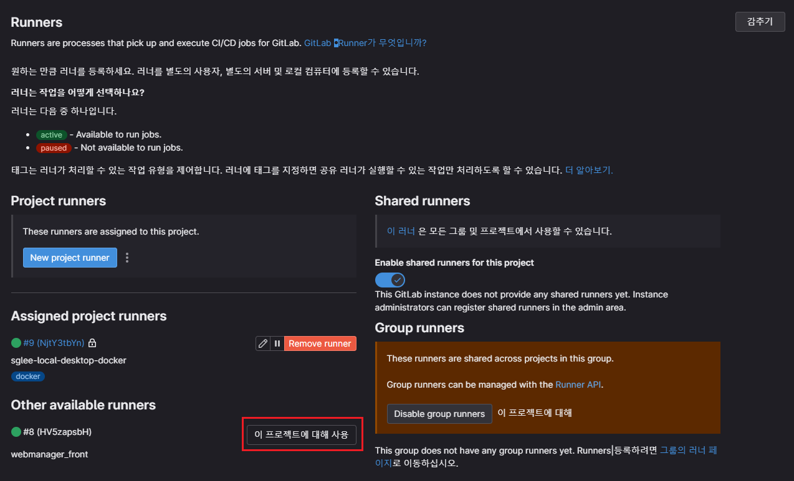

### 개요

Github action에서 Gitlab runner로 전환 작업 중, 전환하게 될 프로젝트에는 필요한 의존성이 많아 Docker 타입의 Runner가 필요한 상황이었다.

하지만 기존에 내부에서 사용중인 Gitlab runner는 Docker를 지원하지 않았다.

따라서 새로운 Gitlab runner를 생성하고, 기존의 Gitlab에 연동시켜야 했다.

위 작업을 진행하며 배운 내용에 대해 정리해보았다.

### Gitlab runner

Gitlab runner는 Gitlab 서버와 별개의 서버에서 CI/CD 파이프라인을 진행시킬 수 있는 프로세스이다. 

이 때, Gitlab runner의 운영환경을 설정할 수 있는데, docker 타입으로 설정하게 되면, 모든 작업을 별도의 격리된 Docker container 안에서 진행시킬 수 있게 된다.

이 때, Docker 타입의 Runner를 실행시키기 위해서는 Runner 자체가 Docker container로 실행되고 있어야 하고, 컨테이너가 실행될 때, docker.sock 이라는 Unix 소켓 파일을 넘겨주어야 했다.

현재의 구상을 도식화하면 다음과 같다.



1. Docker 엔진에 Gitlab runner를 실행시킨다.
2. Gitlab runner는 호스트 엔진의 소켓 파일을 Volume으로 받는다.
3. 이후 작업이 실행되면, 해당 소켓을 사용하여 호스트 엔진에 직접 컨테이너 실행을 한다.

### Gitlab runner docker-compose

Gitlab runner 컨테이너를 실행시키는 Docker compose 스크립트이다.

위에 언급한대로 Volume으로 docker.sock 파일을 지정해주었다.

docker.sock 파일에 대한 내용은 다음의 링크를 참고

- [https://stackoverflow.com/questions/35110146/what-is-the-purpose-of-the-file-docker-sock](https://stackoverflow.com/questions/35110146/what-is-the-purpose-of-the-file-docker-sock)

```yaml
# gitlab runner docker compose

version: '3.6'
services:
  gitlab-runner:
    image: 'gitlab/gitlab-runner:latest'
    container_name: gitlab-runner
    restart: always
    volumes:
      - '/var/run/docker.sock:/var/run/docker.sock'
      - './gitlab-runner:/etc/gitlab-runner'
```

컨테이너를 실행시킨 이후, `docker exec -it gitlab-runner /bin/bash` 명령어를 통해 컨테이너 내부에 접속한다.

### Self-signed Certificate

현재 사내 Gitlab 서버는 Self-signed 인증서를 사용하여 배포되고 있다.

따라서 Gitlab runner를 설정하는데 있어 Certificate validation 문제가 발생하게 된다.

이 문제를 해결하기 위하여, Gitlab runner 컨테이너 내부에 gitlab 도메인에 대한 Self-signed 인증서를 생성한 후, 해당 인증서 파일을 직접 인자로 넘겨주어야 한다.

```bash
# 직접 해당 도메인에 대한 인증서를 생성
openssl s_client -showcerts -connect gitlab도메인:443 -servername gitlab도메인 < /d
ev/null 2>/dev/null | openssl x509 -outform PEM > /etc/gitlab-runner/certs/gitlab도메인.crt
```

```bash
# 인증서 검증
echo | openssl s_client -CAfile /etc/gitlab-runner/certs/gitlab도메인.crt -connect gitlab도메인:443 -servername gitlab도메인
```

### Register runner

위에 생성시킨 Self-signed 인증서를 `—tls-ca-file` 파라미터의 인자로 넘겨주며 Register 커맨드를 실행시킨다.

```bash
cd ~
./entrypoint register --tls-ca-file="/etc/gitlab-runner/certs/gitlab도메인.crt"
```

위 명령어를 실행시키면 여러가지 값을 입력할 수 있게 되는데, 하나씩 확인해 준 뒤 올바른 값을 입력한다.

이 때, Register token은 Gitlab 설정 - CI/CD - Runners 탭에서 `New project runner` 버튼 옆 `…` 버튼 클릭 후 Register token을 복사한 뒤 입력해준다.

또 우리의 경우 Runner의 Type은 docker로 지정해주어야 한다.

[주의] 생성 시 tag를 설정해주게 되면, tag가 지정된 Commit에만 파이프라인이 실행되게 된다.

모두 완료하게 되면, Gitlab 설정 - CI/CD - Runners 탭에 생성된 Runner가 보일 것이다.

### 설정

위에서 생성된 Runner를 보면 잠금 되어있다는 경고가 발생한다.

Gitlab에 Admin 계정으로 접속한 뒤, Runners 설정에서 위 Runner에 대해 잠금을 해제해 주어야 한다.

Gitlab /admin/runners 접속 후



새로 생성된 Gitlab runner의 오른쪽 편집 아이콘을 클릭



현재 프로젝트에 대해 Lock 체크박스 해제

특정 프로젝트의 파이프라인에 위 Runner를 사용하고 싶다고 한다면, 프로젝트 - 설정 - CI/CD - Runners에서 위 Runner를 사용으로 설정해주면 된다.



끝