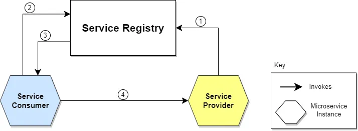

## 동기식, 비동기식 통신 방식

### 동기식 통신 방식

동기식 통신 방식은 요청 후 바로 결과값을 받는 통신 방식이다.

대부분 요청/응답 모델로 이루어져 있는데, 현재 존재하는 시스템의 대부분이 이 통신 방식을 사용중일 것이다.

동기식 통신 방식은 요청을 보낸 후 결과값을 받을 때까지 스레드가 Blocking 되는 특징이 있는데, 이 때문에 응답 지연 시간이 긴 요청의 경우 트래픽이 많아지게 되면 장애가 발생하게 되는 위험이 존재한다.

하지만 구현이 간편하고, 요청의 결과 값이 필요한 대부분의 상황에서 선택하기에 좋은 방식이라고 생각한다.

**REST API**

REST API는 HTTP 기반의 Client 및 서버만 구현하면 되기 때문에, 통신 방식 중에 가장 구현하기 간편하다. 

**gRPC**

HTTP 2 및 Protocol Buffer 기반의 동기 통신 방식인 gRPC는 일반적인 HTTP보다 가벼운 통신이 가능하다.

또한 상호간에 미리 지정한 스키마로만 통신이 가능하기 때문에, 안정성이 높아지는 장점이 있다.

하지만 서로 동일한 스키마로 통신해야 하기 때문에 상호간 의존성이 너무 높아질 수 있고, 스키마를 변경하게 될 경우 모든 Client에 배포해주어야 하는 단점이 있다.

### 비동기 통신 방식

비동기식 통신 방식은 요청 후 결과 값을 바로 받지 않는 통신 방식을 말한다.

비동기식 통신 방식을 사용할 경우 서비스 간 결합도를 낮추는 장점이 있으며, 성능 상의 이점이 있을 수 있다.

하지만 동기식 통신 방식에 비해 구현이 복잡하고 어려우며, 여러 서비스가 하나의 트랜잭션으로 처리되어야 할 경우 트랜잭션 관리가 어렵다는 단점이 있다.

비동기식 통신 방식에는 보통 구독/발행 모델을 주로 사용한다.

구독/발행 모델은 서비스 소비자가 특정 토픽을 구독하고 있으면, 공급자가 해당 토픽에 메시지를 보내고, 구독자가 그것을 받는 방식이다.

AWS에서는 SNS와 SQS를 조합해서 구현한다.

## 서비스 디스커버리

마이크로 서비스 간 동기식 통신을 하기 위해서는 호스트의 IP및 Port가 필요하다.

하지만 마이크로 서비스를 배포할 때는 보통 컨테이너 기반으로 배포되기 때문에, 고정 IP 주소가 없는 경우가 많다.

이러한 경우, 동적으로 변화하는 서비스 주소를 손쉽게 찾을 수 있도록 Service Registry를 구성하고 이를 이용하여 동적인 서비스를 호출하기 쉽게 도와주는 기술이 서비스 디스커버리이다.

마이크로 서비스가 다른 서비스에 요청을 할 때, 서비스 디스커버리를 통해 상대방 서비스에 대한 주소를 조회하고, 해당 주소로 요청을 보내게 되는 방식이다.

1. 서비스 공급자가 본인의 IP및 Port 정보를 서비스 레지스트리에 등록
2. 서비스 소비자가 서비스 공급자의 정보를 서비스 레지스트리로 요청
3. 서비스 레지스트리로부터 공급자의 IP 및 Port 정보 조회
4. 해당 정보로 서비스 요청

## 서비스 메쉬

서비스 메쉬는 네트워크 인프라를 추상화하는 강력한 디자인 패턴으로, 서비스와 함께 사이드카 프록시를 배포하는 방식이다.

서비스의 모든 트래픽은 Envoy 프록시를 통해 처리되게 되며, 각 Envoy 프록시는 중앙의 컨트롤 플레인에 각 서비스를 등록하게 된다.

전체적인 구성은 서비스 디스커버리와 비슷하지만, Envoy 프록시를 사용하는 부분이 다르다.

서비스 메쉬를 사용하면 얻는 이점은 다음과 같다.

- 로드 밸런싱
    - 하나의 서비스에 등록 된 여러 노드에 순차적으로 요청을 보냄으로서 부하 분산이 가능하다.
- Observability
    - Envoy 프록시로 서비스 노드의 지표나 로그등을 수집하여 AWS의 CloudWatch나 X-Ray를 통해 모니터링 할 수 있다.
- 서비스 디스커버리
    - Envoy 프록시를 통해 서비스를 등록함으로써 서비스 디스커버리를 구현할 수 있다.
- 내결함성 (Fault Tolerance)
    - 프록시와 가상 라우터를 통해 트래픽을 조절할 수 있기 때문에, 장애 발생 시 트래픽을 우회하거나, 빠르게 실패할 수 있는 등 내결함성을 지킬 수 있다.
- 멀티 테넌시
    - Envoy 프록시를 통해 트래픽을 통제할 수 있기 때문에, 공용 리소스에 접근하는 트래픽에 대해 테넌트 별로 다른 스로틀링 규칙을 설정할 수 있다.
    - 또한 특정 서비스에 대해 테넌트 별로 접근을 통제할 수도 있다.
- 커뮤니케이션 최적화
    - 서비스 메쉬가 서비스 간 커뮤니케이션의 모든 부분을 성능 메트릭으로 캡처하기 때문에, 서비스 간 커뮤니케이션에 대한 규칙을 적용하여 효율적이고 안정적인 서비스 요청이 가능하다.
    - 예를 들어, 서비스에 장애가 발생한 경우 서비스 메쉬는 재시도가 성공하기까지 소요한 시간에 대한 데이터를 수집하고, 특정 서비스의 장애 시간에 대한 데이터가 집계되면 해당 서비스를 재시도하기 전까지 최적의 대기 시간을 결정하는 규칙을 작성하여 시스템이 불필요한 재시도로 인해 과부하되지 않도록 할 수 있다.
- 보안 (mTLS)
    - mTLS (상호 TLS) 는 기존의 서버의 인증서로만 TLS 인증을 했었던 것과는 달리, 서버와 클라이언트 모두가 각자의 X.509 인증서로 상호 인증하는 방법이다.
        
        서비스 메쉬의 Envoy 프록시를 사용하게 되면, 모든 서비스 간 통신이 이 프록시를 거치게 되기 때문에, mTLS와 같은 보안 계층 설정도 가능하게 된다.
        

서비스 메쉬를 사용하면 얻을 수 있는 또 하나의 장점은, 서비스를 개발하면서 서비스 코드 안에 위치시켰어야 할 다양한 공통 로직을 제거할 수 있다는 점이다.

마이크로 서비스에 장애가 발생했을 때, 장애가 전파되지 않도록 하는 서킷 브레이커나 재시도 로직 등은 서비스 안에서 다른 서비스를 호출하는 로직 내에서 처리해주어야 했다. (Resilience4j 와 같은 라이브러리를 사용해서)

또는 다른 서비스를 호출할 때 Trace를 적용하여 트래픽을 모니터링 하려고 해도, AWS의 X-Ray SDK 등을 사용해서 API 호출부를 감싸주는 작업이 필요했다.

하지만 서비스 메쉬를 사용하게 되면 Envoy 프록시가 이러한 기능들을 수행해주기 때문에 서비스를 개발하는데에 필요한 코드가 훨씬 줄어들게 된다.

### AWS AppMesh

AWS에서 제공하는 서비스 메시 서비스이다.

기존에 배포된 서비스를 가상 노드에 연결한 뒤, 이를 가상 서비스를 통해 호출하는 방식이다.

가상 서비스는 가상 라우터를 통해 가상 노드에 대한 트래픽을 라우팅하게 된다.

AppMesh를 사용하면 위에 나열한 서비스 메시의 다양한 이점을 간편하게 얻을 수 있으며, 또한 기존의 AWS 서비스들과 통합하는 것도 간편하다.

또한 AWS AppMesh는 무료로 사용할 수 있다. 다만 Envoy 프록시를 실행시킬 소형 컨테이너를 띄워주어야 하기 때문에 그 비용만 지불하면 된다.