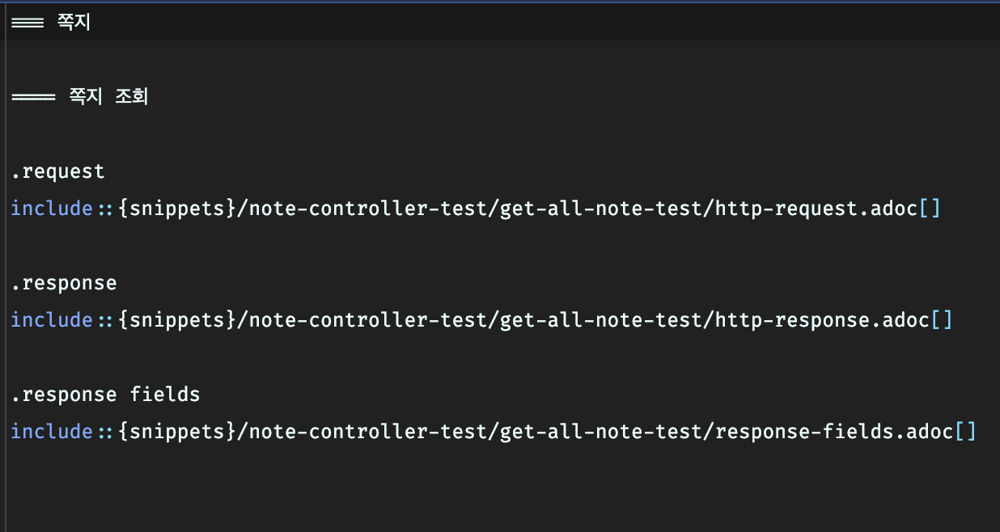

# 목표

현재 개발중인 프로젝트의 API 문서는 Rest docs와 함께 AsciiDoctor을 사용하여 생성하고 있다.

Restdocs란 특정 방식으로 Controller 테스트를 작성하고, `adoc`이라는 확장자의 AsciiDoc 문서를 작성하면 자동으로 웹 기반의 API 문서를 생성해주는 라이브러리이다.

```java
// restdocs 예시
@Test
@DisplayName("쪽지 목록 조회")
void getAllNoteTest() throws Exception {
    //given
    given(noteService.getAllNote()).willReturn(getNoteList());

    mockMvc.perform(get("/api/v1/notes"))
            .andExpect(status().isOk())
            .andDo(doc.document(
                    responseFields(
                            fieldWithPath("[].index").type(JsonFieldType.NUMBER).description("쪽지 인덱스"),
                            fieldWithPath("[].contents").type(JsonFieldType.STRING).description("쪽지 내용"),
                            fieldWithPath("[].createdAt").type(JsonFieldType.STRING).description("작성 일자")
                    )
            ));
}
```



adoc 예시

Swagger를 사용했을 때 비즈니스 코드(Controller 및 DTO)에 API 문서 관련 코드가 침투하는 문제가 생겨 RestDocs를 사용하게 되었다.

하지만 RestDocs를 사용하면 API 문서의 UI 선택이 제한적이라는 점과, 모든 문서에 대해 Controller 테스트 및 adoc 파일을 별도로 작성해주어야 한다는 단점이 있다.


Restdocs + AsciiDoctor 로 생성된 API 문서 예시

현재 우리 팀에서는 API 문서가 늘어남에 따라 왼쪽의 메뉴 탭이 너무 길어지는 문제가 발생하였다.

AsciiDoc 문서를 대메뉴 별로 나누어서 페이징 처리할 수 있는 방법이 있는 것 같지만, 현재 우리가 사용하고 있는 org.asciidoctor.jvm.convert 플러그인에서는 동작하지 않는 것으로 보인다.

조사를 거친 후 `restdocs-api-spec` 라는 라이브러리를 사용하면 Restdocs 테스트를 작성하는 것 만으로 OpenAPI3 표준의 API 문서를 생성할 수 있다는 것을 확인하였다.

OpenAPI 표준의 문서는 Yaml 혹은 Json 포맷으로 생성되는데, 이 표준을 사용하는 다양한 API 문서 UI를 사용할 수 있는 장점이 있다.


openapi3.yaml 예시

위 방식을 사용하여 OpenAPI3 표준을 사용하는 UI 중 하나인 Redoc을 사용해보도록 한다.


ReDoc UI

# restdocs-api-spec

먼저 `build.gradle` 에 restdocs-api-spec 플러그인 및 라이브러리를 추가해준다.

```groovy
plugins {
	id 'java'
	id 'org.springframework.boot' version '3.4.5'
	id 'io.spring.dependency-management' version '1.1.4'
  id 'com.epages.restdocs-api-spec' version '0.18.2' // <- 추가
}

...

dependencies {
...
    testImplementation 'com.epages:restdocs-api-spec-mockmvc:0.18.2' // <- 추가

...

// 아래 Task 추가
openapi3 {
    setServer("http://localhost:8080")
    title = "API 문서"
    version = "$version"
    format = "yaml"
}

```

이후 모든 Controller 테스트 코드에서 Restdocs 방식의 테스트를 수정해주어야 한다.

기존에는 `RestDocumentationResultHandler` 클래스를 주입받아 사용하거나, `MockMvcRestDocumentation.document()` static 메서드를 사용해서 테스트를 작성했을 것이다.

```groovy
// restdocs 예시
@Test
@DisplayName("쪽지 목록 조회")
void getAllNoteTest() throws Exception {
    //given
    given(noteService.getAllNote()).willReturn(getNoteList());

    mockMvc.perform(get("/api/v1/notes"))
            .andExpect(status().isOk())
            .andDo(document( // <- 이 메서드
                    "NoteControllerTest/getAllNoteTest",
                    responseFields(
                            fieldWithPath("[].index").type(JsonFieldType.NUMBER).description("쪽지 인덱스"),
                            fieldWithPath("[].contents").type(JsonFieldType.STRING).description("쪽지 내용"),
                            fieldWithPath("[].createdAt").type(JsonFieldType.STRING).description("작성 일자")
                    )
            ));
}
```

이 테스트 코드는 전혀 수정할 필요가 없고, 단지 document() static 메서드의 클래스만 기존의 `MockMvcRestDocumentation` 에서 `MockMvcRestDocumentationWrapper` 로 변경해주면 된다.

```groovy
import static com.epages.restdocs.apispec.MockMvcRestDocumentationWrapper.document;
```

# Redoc 문서 생성

위 과정을 모두 진행하고 난 후, 새로 생성한 `openapi3` 태스크를 실행하면 `build/api-spec/` 경로에 `openapi3.yaml` 파일이 생성되게 된다. (Test 태스크를 먼저 실행시켜야 함.)

이 `openapi3.yaml` 파일은 별도의 디렉토리에 잘 복사해놓는다.

이후 `openapi3.yaml` 파일이 있는 디렉토리 경로에서 Shell을 실행시킨 뒤, Redoc CLI를 사용하여 문서를 생성한다.

이 때 Node.js가 기본적으로 설치되어 있어야 한다.

```bash
npx @redocly/cli build-docs openapi3.yaml
```

잠시 기다리면 `redoc-static.html` 라는 이름의 API 문서가 생성된 것을 확인할 수 있다.


# API 문서에 제목 및 태그 추가

기존 Restdocs 방식으로 문서를 생성하게 되면 `adoc` 파일을 작성하여 직접 API 문서의 순서를 정하고 제목이나 설명을 작성할 수 있었다.

하지만 `restdocs-api-spec`를 사용하게 되면 더 이상 `adoc` 파일을 작성할 필요가 없어지기 때문에 문서의 제목이나 설명, 메뉴 구분 등을 표현할 수 없게 된다.

위 예시를 보면 알 수 있듯이 모든 문서들이 `document()` static 메서드에 정의한 Identifier로만 표시되게 되고, 또한 모든 문서들이 API라는 대메뉴 안에 있게 된다.

OpenAPI 표준에서는 메뉴를 표현하기 위해 Tag를 지정하도록 되어있고, 각 문서마다 Summary와 Description을 정의해서 문서의 제목이나 설명을 표현하도록 되어있다.

restdocs-api-spec 라이브러리에서도 이러한 문제를 해결하기 위해 각 테스트 별로 Tag, summary, description 등을 작성할 수 있는 방법을 제공한다.

방법은 기존 `document()` static 메서드 안에 `com.epages.restdocs.apispec.ResourceDocumentation.resource()` 메서드를 삽입한 후 `ResourceSnippetParameters` 클래스의 객체로 해당 내용을 정의하면 된다.

```java
@Test
@DisplayName("쪽지 목록 조회")
void getAllNoteTest() throws Exception {
    //given
    given(noteService.getAllNote()).willReturn(getNoteList());

    mockMvc.perform(get("/api/v1/notes"))
            .andExpect(status().isOk())
            .andDo(document("NoteControllerTest.getAllNoteTest", "",
                    resource(ResourceSnippetParameters.builder() // <- 추가
                            .summary("쪽지 목록 조회")
                            .description("쪽지 목록을 조회한다.\n\n### error codes\n\n|code|설명|\n|-|-|\n|401|abc|\n|402|def|") // <- 보통 Markdown 형식을 지원함
                            .tag("Note")
                            .responseFields(
                                    fieldWithPath("[].index").type(JsonFieldType.NUMBER).description("쪽지 인덱스"),
                                    fieldWithPath("[].contents").type(JsonFieldType.STRING).description("쪽지 내용"),
                                    fieldWithPath("[].createdAt").type(JsonFieldType.STRING).description("작성 일자")
                            )
                            .build()
                    )
            ));
}
```

이렇게 하면 각 문서가 Tag를 이름으로 하는 메뉴에 속하게 되며 문서의 이름 또한 표시되는 것을 확인할 수 있다.


현재의 OpenAPI Specification 표준으로 메뉴(태그)는 1 depth로만 정의가 가능하다는 것 같다.

끝