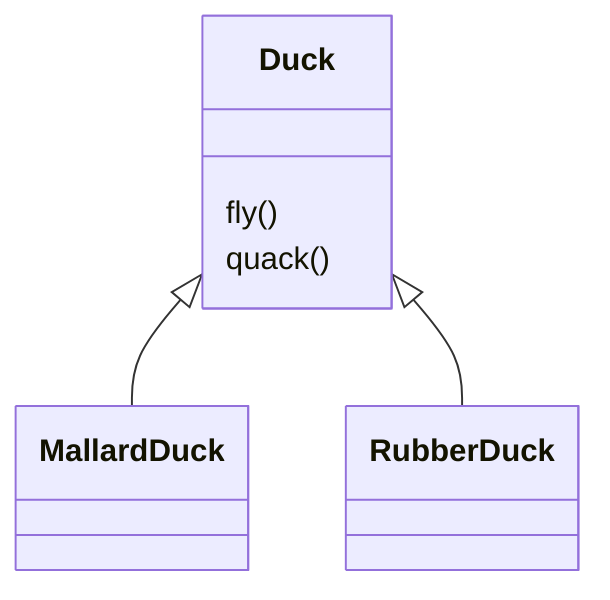
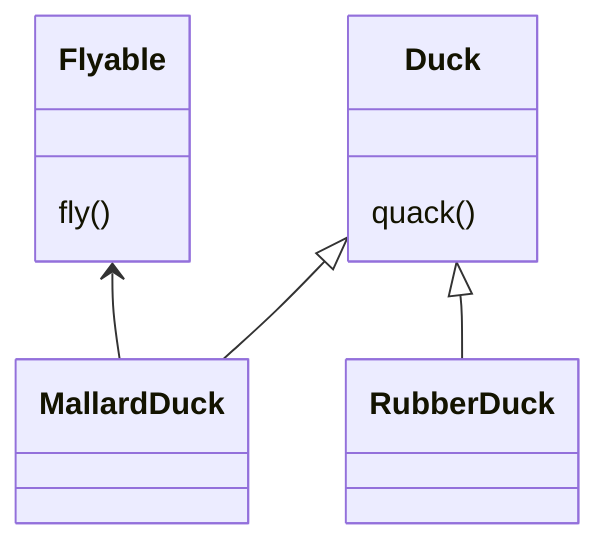
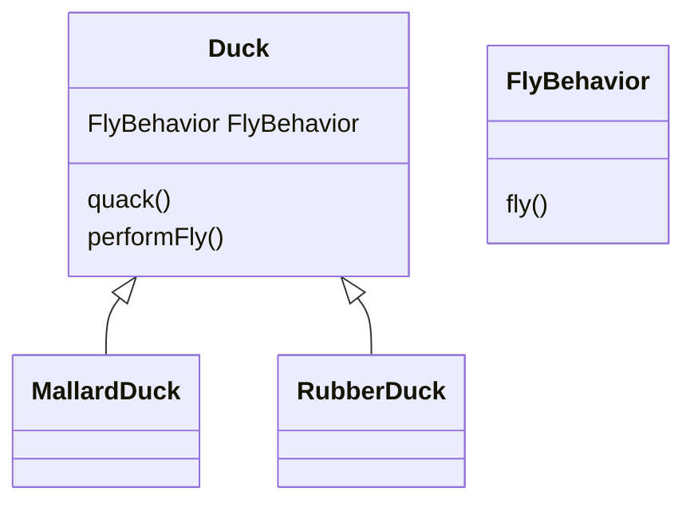

어떤 클래스 A를 상속받는 여러 서브 클래스가 있다고 가정하자.

클래스 A는 어떤 동작 메서드를 가지고 있고, 모든 서브 클래스가 이를 상속받아 사용하고 있었다.

그런데 만약 새로운 서브 클래스가 생겼고, 이 서브 클래스는 클래스 A의 메서드를 사용하지 않는 클래스라고 한다면 어떻게 할 것인가.

클래스 A는 Duck 이라고 하고 해당 메서드는 fly() 라고 해보자.

새로 추가된 서브 클래스가 고무 오리라고 한다면 fly() 메서드가 필요하지 않을 것이다.

가장 먼저 고민해볼 것은, Flyable 이라는 인터페이스를 만들고, 인터페이스 안에 fly 메서드를 선언해놓는 것이다.

Duck 클래스에서는 fly() 메서드를 제거하고, 서브 클래스들 중에 fly() 메서드가 필요한 클래스만 해당 인터페이스를 구현하는 방식이다.

하지만 이 방식은 서브 클래스가 늘어나면 늘어날 수록 구현해주어야 할 코드가 늘어나기 때문에 코드 중복에 취약해진다.

전략 패턴을 사용하여 이 문제를 해결해보자.

FlyBehavior 라는 인터페이스 안에 fly() 메서드를 선언해 놓은 뒤, fly 동작이 일어나는 여러 서브 클래스들을 구현해놓는다.

예를 들어 날개를 사용해서 날면 FlyWithWing 이나 날지 않는다면 FlyNoWay 같은 클래스들을 말이다.

그리고 Duck 클래스에 존재하는 fly 메서드를 제거한 뒤, 위 FlyBehavior 메서드를 변수로 선언한다.

Duck 클래스에서는 해당 변수안에있는 fly() 메서드를 호출하는 메서드를 선언하게 된다.

이제 Duck 클래스를 상속받은 서브 클래스의 인스턴스를 생성할 때, 생성자 안에서 해당 FlyBehavior 변수에 들어갈 구체 클래스를 생성해서 넣어주게 된다.

이러한 패턴을 전략패턴이라고 부른다. 

서브 클래스들이 수퍼 클래스가 사용할 알고리즘을 직접 생성해서 넣어주는 방식이라고 할 수 있다.