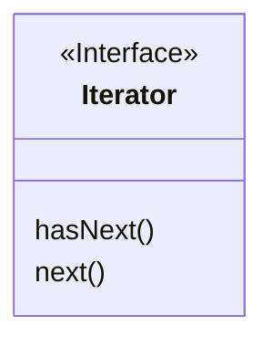
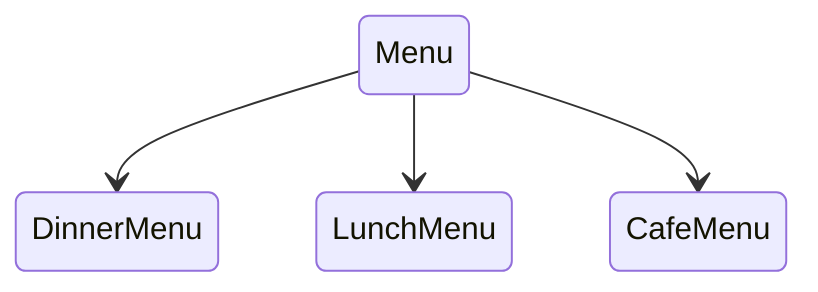
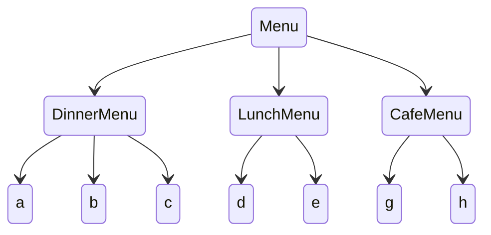
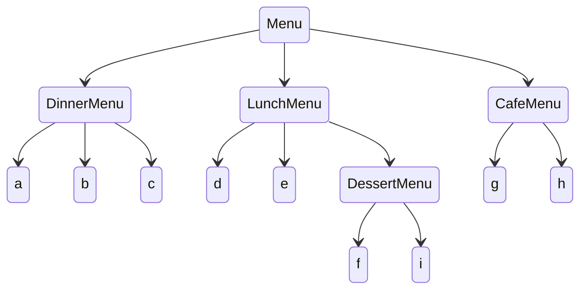
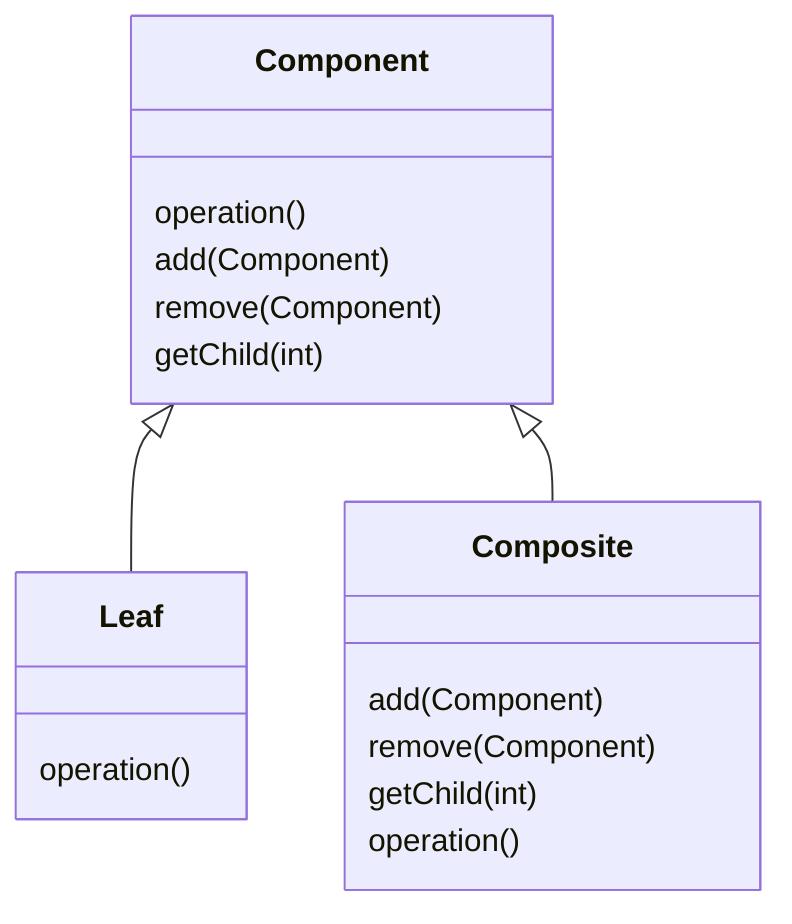

## 이터레이터 패턴

이터레이터 패턴이란, 어떤 컬렉션 타입이더라도 순회할 수 있도록 해주는 패턴을 말한다.

예를 들어 같은 객체를 담고 있는 컬렉션 객체가 2개 있는데, 이 중 하나는 배열에 담고있고, 하나는 ArrayList에 담고있다고 해보자.

두 객체의 값을 합쳐야 하는 경우에는, 각각 ArrayList와 배열을 가져와서 다른 방법으로 순회해주어야 한다.

이러한 경우에, Iterator라는 인터페이스를 아래와 같이 만들고, 각 객체에서 구현해준다면 같은 방식으로 순회가 가능해지게 된다.



Iterator 인터페이스를 간단히 소개하자면, `hasNext()` 메서드는 현재 순회자 이후에 값이 있는지를 확인하는 기능이고, `next()`는 다음 값을 반환해주는 메서드이다.

실제로 사용할 때에는 다음과 같이 사용하게 된다.

```java
while (iterator.hasNext()) {
	Item item = iterator.next();
}
```

결과적으로 Iterator 패턴은, 컬렉션 구현 방법을 노출시키지 않으면서도 그 컬렉션 안에 들어있는 모든 항목에 접근할 수 있게 해주는 방법을 제공해준다.

### FAQ

- 왜 java.util.Iterator 인터페이스에는 `first()` 함수가 없을까?
    - 인터페이스를 최대한 간결하게 유지하기 위해, 또 첫 번째 인자를 얻기 위해서는 Iterator 객체를 하나 더 만들면 되기 때문에.
- HashTable과 같이 정해진 순서가 없는 경우의 반복작업 순서는 어떻게 정해질까?
    - 반복자는 특별한 순서가 정해져있지 않다. 따라서 접근 순서라는 것은 사용된 컬렉션의 특성 및 구현하고 연관되어 있다. 일반적으로 컬렉션 문서에 언급되어있지 않은 이상, 순서에 대한 것은 가정하면 안된다.

자바 5부터는 `for/in` 이라는 새로운 for 선언문이 추가되었다.

이 선언문을 사용하면, 별도의 Iterator 객체를 만들지 않아도 컬렉션이나 배열에 대해서 순환문을 돌릴 수 있게 된다.

```java
for (Object obj: collection) {
	...
}
```

## 컴포지트 패턴

컴포지트 패턴은 객체들을 트리 구조로 구성하여 부분과 전체를 나타내는 계층구조로 만들 수 있다.

이 패턴을 이용하면 클라이언트에서 개별 객체와 다른 객체들로 구성된 복합 객체(composite)를 똑같은 방법으로 다룰 수 있게 된다.

예를 들어 아래와 같은 트리 구조가 있다고 가정해보자.



전체 메뉴 안에 저녁, 점심, 카페 메뉴가 포함되어 있는 구조이다.

각 메뉴에는 메뉴 아이템들이 포함되어 있다.



만약 여기에서 점심 메뉴에 디저트 메뉴가 포함되어야 한다고 해보자.



아러한 구조를 객체로 구현할 때, 복합 구조(Composite) 패턴을 사용할 수 있다.

컴포지트 패턴의 주요 구조는 다음과 같다.



Client는 Component 인터페이스를 사용해서 복합 객체 내의 객체들을 조작하게 된다.

Component 인터페이스는 복합 객체 안에 들어있는 모든 객체들에 대한 인터페이스를 정의한다.

Leaf 클래스는 자식이 없는 마지막 노드 객체이기 때문에, 구성 요소를 조작하는 기능이 없다.

Composite 클래스는 자식이 있는 클래스이기 때문에, 구성 요소를 조작하는 기능을 포함하게 된다.

보통 Composite 클래스에는 Component 타입의 자식 객체를 담고있는 필드를 가지게 된다.

최종적으로 Composite 구조에서는 재귀적 동작을 통해 Component 객체의 모든 자식 객체들을 조작할 수 있게 되었다.

컴포지트 패턴을 사용하게 되면, 한 클래스에서 계층구조를 관리하는 일과 구성요소를 조작하는 일, 두 가지 일을 하게 되는 클래스가 되게 된다.

하지만 이 경우 객체 지향 원칙 중 하나인 단일 역할 원칙을 깨면서 대신에 투명성을 확보하기 위한 패턴이라고 할 수 있다.

Component 인터페이스에 자식들을 관리하기 위한 기능과 Leaf로서의 기능을 전부 집어넣음으로써 클라이언트에서 복합 객체와 Leaf 노드를 똑같은 방식으로 처리할 수 있게 된다.

어떤 원소가 복합 객체인지 Leaf 노드인지가 클라이언트 입장에서 투명하게 느껴진다는 의미이다.

상황에 따라 원칙을 적절하게 사용해야 한다는 것을 보여주는 사례라고 할 수 있겠다.