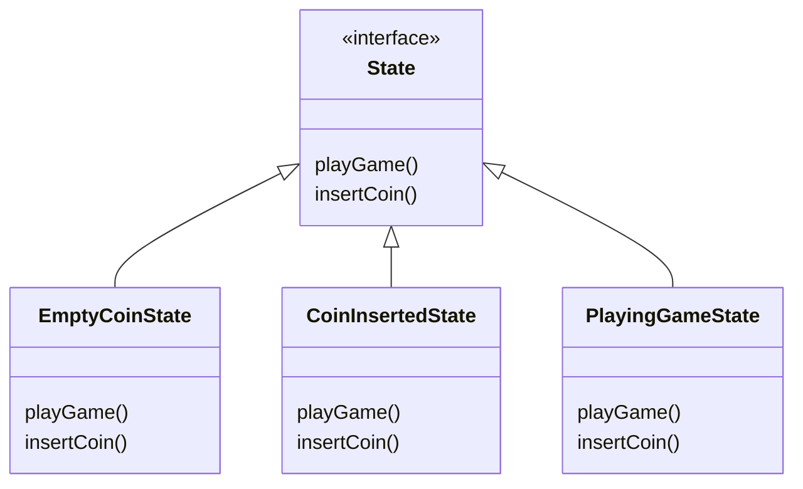

어떤 클래스에 여러개의 상태가 있고, 메서드들은 그 상태에 따라서 다른 행동을 하는 클래스가 있다고 하자.

```java
public class GameMachine {
  private int COIN_INSERTED = 1;
  private int COIN_EMPTY = 2;
  private int GAME_PLAYING = 3;
  
  int coins = 0;
  int state = COIN_EMPTY;
  
  public void playGame() {
    if (state == COIN_INSERTED) {
      // play game
    } else if (state == COIN_EMPTY) {
      // error
    } else if (state == GAME_PLAYNG) {
      // error
    }
  }

  public void insertCoin() {
    if (state == COIN_INSERTED) {
      // add coin    
    } else if (state == COIN_EMPTY) {
      // add coin
    } else if (state == GAME_PLAYNG) {
      // error
    }
  }
}
```

이런 식으로 해당 클래스의 모든 메서드에는 그 상태에 대한 분기 처리가 들어가야 한다.

이 방식으로도 코드는 문제없이 돌아가지만, 만약 상태 값이 추가될 경우에는 모든 메서드에 그 상태에 대한 분기문을 다시 작성해주어야 한다.

스테이트 패턴은 이러한 문제를 해결하기 위하여 모든 상태를 클래스로 분리하여 캡슐화 하는 디자인 패턴이다.

위의 예시는 아래와 같이 클래스를 분리할 수 있겠다.



EmptyCoinState 클래스를 구현해보면 다음과 같다.

```java
public class EmptyCoinState implements State {

  // 메인 클래스를 인스턴스 변수로 선언
	private GameMachine gameMachine;

	public EmptyCoinState(GameMachine gameMachine) {
	  this.gameMachine = gameMachine;
	}

  public void playGame() {
    // Coin이 없는 상태로 게임을 실행하면 에러가 발생
  }

  public void insertCoin() {
    // add coin
    
    // gameMachie 객체의 상태를 현재 클래스의 인스턴스로 변경
    gameMachine.setState(gameMachine.getEmptyCoinState());
  }
}
```

```java
public class GameMachine {

  // 각 State 클래스의 객체를 인스턴스 변수로 선언
	private EmptyCoinState emptyCoinState;
	private CoinInsertedState coinInsertedState;
	private PlayingGameState playingGameState;
	
	// 상태를 담을 변수 선언
	private State state;

	public GameMachine() {
		this.emptyCoinState = new EmptyCoinState(this)
		this.coinInsertedState = new CoinInsertedState(this)
		this.playingGameState = new PlayingGameState(this)
	}

  public void playGame() {
    // 현재 상태의 메서드를 호출
    state.playGame();
  }

  public void insertCoin() {
    state.insertCoin();
  }
  
  public void setState(State state) {
    this.state = state;
  }
  
  // State 객체들의 getter...
}
```

이렇게 남은 State 클래스들도 구현을 마치게 되면, 이전 구조와 비교하여 다음과 같은 이점을 얻게된다.

- 관리하기 힘든 if 선언문을 없앰.
- 각 상태에 대해 변경에는 닫혀있고, 확장에는 열려있도록 수정됨. (OCP)

> State 패턴을 사용하면 객체의 내부 상태가 바뀜에 따라서 객체의 행동을 바꿀 수 있다. 마치 객체의 클래스가 바뀌는 것과 같은 결과를 얻는다.
> 

### State 패턴이 Strategy 패턴과 비슷한 것 아닌가?

다이어그램 상으로는 비슷해 보일 수 있으나, 실제 용법 면에서 차이가 있다.

상태 패턴의 경우 상태 객체의 일련의 행동이 캡슐화 된다.

상황에 따라 Context 객체에서 여러 상태 객체 중 한 객체에게 모든 행동을 맡기고, 또한 객체의 내부 상태에 따라 상태 객체가 바뀌게 된다.

결과적으로 클라이언트는 상태 객체에 대해 거의 아무것도 몰라도 된다.

하지만 전략 패턴의 경우 클라이언트가 어떤 전략을 사용해야 하는지 Context 객체에 지정해준다.

전략 패턴은 주로 실행 시에 전략 객체를 변경할 수 있는 유연성을 제공하기 위한 용도로 쓰인다.