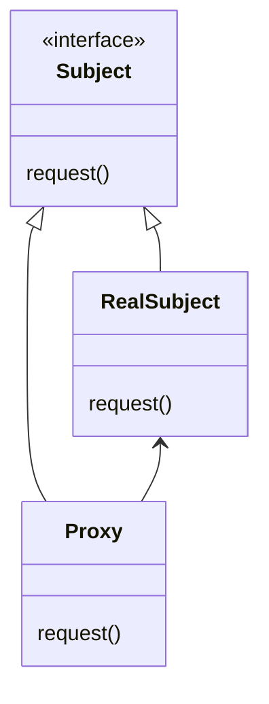

프록시 패턴은 어떤 객체에 대한 접근 을 제어하기 위한 용도로 대리인이나 대변인에 해당하는 객체를 제공하는 패턴을 말한다.

프록시 패턴에는 여러가지 변종이 존재하는데 각각 프록시에서 접근을 제어하는 방법의 차이를 보인다.

프록시 패턴의 종류는 다음과 같다.

- 원격 프록시
    - 원격 객체에 대한 접근을 제어
- 가상 프록시
    - 생성하기 힘든 자원에 대한 접근을 제어
- 보호 프록시
    - 접근 권한이 필요한 자원에 대한 접근을 제어

프록시 패턴의 간략한 다이어그램은 다음과 같다.

우선 RealSubject와 Proxy의 인터페이스를 제공하는 Subject 인터페이스가 있다.

두 객체에서 똑같은 인터페이스를 구현하기 때문에 RealSubject가 들어가야 할 자리에 Proxy를 대신 집어넣을 수 있게 된다.

실제 작업은 RealSubject 객체에서 처리된다.

Proxy는 이 객체의 대변인 역할만 하면서 이 객체에 대한 접근을 제어한다.

Proxy에는 RealSubject에 대한 레퍼런스가 들어있다.

Proxy에서 RealSubject를 생성하거나 제거하는 역할을 책임지는 경우도 있다. 

클라이언트는 항상 Proxy를 통해서 RealSubjec하고 데이터를 주고 받는다.

또한 Proxy는 RealSubject에 대한 접근을 제어하는 역할도 맡게 된다.

RealSubject가 원격 시스템에서 돌아가거나, 그 객체를 생성하는 데 비용이 많이 들거나, 어떤 방식으로든지 RealSubject에 대한 접근이 통제 되어있는 경우, 접근을 제어해주는 객체가 필요할 수 있다.