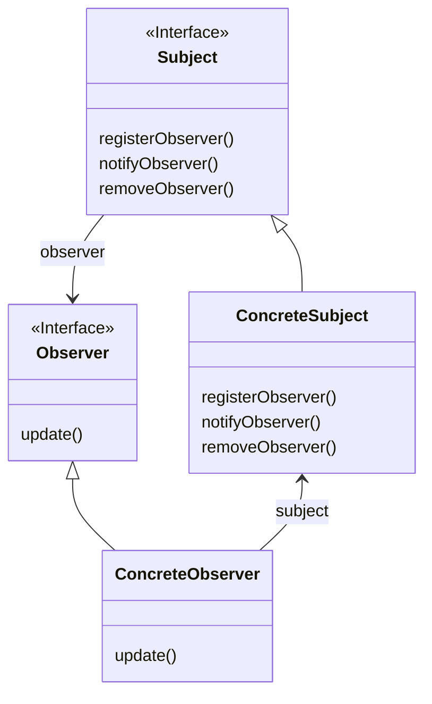

옵저버 패턴이란 한 객체의 상태가 바뀌면 그 객체에 의존하는 다른 객체들한테 연락이 가고, 자동으로 내용이 갱신되는 방식으로 일대다 (one-to-many) 의존성을 정의한다.

옵저버 패턴을 구현하는 방법에는 여러 가지가 있지만, 대부분 주제(Subject) 인터페이스와 옵저버(Observer) 인터페이스가 들어있는 클래스 디자인을 바탕으로 한다.



- 주제를 나타내는 Subject 인터페이스에서는 옵저버를 등록하거나, 옵저버에 알림을 주는 메서드가 포함되어 있다.
- 옵저버가 될 가능성이 있는 객체는 Observer 인터페이스를 구현한다. 해당 인터페이스에는 주제의 상태가 바뀌었을 때 호출되는 update() 메서드가 있다.
- 주제 역할을 하는 구상 클래스 ConcreteSubject는 각 주제의 행동에 대한 모든 메서드를 구현한다.
- Observer 인터페이스만 구현하면 무엇이는 옵저버 클래스가 될 수 있다. 각 옵저버는 특정 주제 객체에 등록을 해서 연락을 받을 수 있다.
- 해당 구성에서는 상태를 지배하는 것은 주제 객체 하나 뿐이기 때문에, 여러 옵저버에 대한 정보(상태)를 가지고 있는 객체는 주제 객체 뿐이다.

## 느슨한 결합의 위력

두 객체가 느슨하게 결합되어 있다는 것은, 그 둘이 상호작용을 하긴 하지만, 서로에 대해 서로 잘 모른다는 것을 의미한다.

옵저버 패턴에서는 주제와 옵저버가 느슨하게 결합되어 있는 객체 디자인을 제공한다.

주제가 옵저버에 대해 하는 것은 옵저버가 특정 인터페이스를 구현한다는 것 뿐이기 때문이다.

옵저버의 구상 클래스가 무엇인지, 옵저버가 무엇을 하는지 등에 대해서는 알 필요가 없다.

또 옵저버는 언제든지 새로 추가할 수 있다. 마찬가지로 아무 때나 제거할 수도 있다.

## 자바에서 Observer 패턴 사용하기

자바에서는 몇 가지 API를 통해 자체적으로 옵저버 패턴을 제공한다.

위에서 설명한 Subject 인터페이스는 java.util.Observable 클래스로, Observer 인터페이스는 java.util.Observer 인터페이스로 제공된다.

위와 다른 점은 Observable 클래스가 Subject 인터페이스와 다르게 구체 클래스이기 때문에, 실제 사용할 때에는 해당 클래스를 상속받아야 한다는 점이다.

또한 Observable 클래스는 push 방식 뿐만 아니라 poll 방식도 제공하고 있는데,

- push방식 : Observable 클래스의 notifyObservers(Obect arg) 메서드를 통해 데이터를 직접 보내준다.
- poll방식 : Observable 클래스의 notifyObservers() 메서드가 호출되면 본인의 레퍼런스를 넘겨주어 옵저버 클래스가 본인 레퍼런스를 통해 직접 데이터를 가져갈 수 있도록 한다.

Observable 클래스를 확장하면, 옵저버 클래스에 연락하거나, 옵저버 클래스들의 레퍼런스를 저장할 자료구조를 선언해주는 코드를 직접 작성할 필요가 없다.

Observable과 Observer 를 사용하여 구현한 옵저버 패턴의 예시는 다음과 같다.

WeatherData 클래스는 날씨 데이터가 업데이트 되면 옵저버들에게 데이터를 보내주는 내용의 클래스이다.

```java
public class WeatherData extends Observable {
	private float temperature;
	
	public void mesurementsChanged() {
		setChanged();      // 수퍼 클래스의 setChanged() 를 먼저 호출해서 상태가 바뀜을 알림
		notifyObservers(); // 수퍼 클래스의 notifyObservers() 호출
	}
	
	// 본 클래스의 데이터가 변경되었을 때, 옵저버 클래스에 알림 보내는 메서드 호출
	public void setMeasurements(float temperature) {
		this.temperature = temperature;
		measurementsChanged(); 
	}
	
	// getter..
}
```

CurrentConditionDisplay 클래스는 위 WeatherData 클래스를 구독하고 데이터가 변경되었을 때 알림을 받아 적절하게 데이터 표현을 해주는 클래스이다.

```java
public class CurrentConditionDisplay implements Observer {
	private Observable observable;  
	private float temperature;
	
	// 생성자로 객체가 생성될 때 Observable 클래스를 변수로 받는다.
	public CurrentConditionDisplay(Observable observable) {
		this.observable = observable;
		observable.addObserver(this);  // Observable 객체에 본인 객체를 등록
	}
	
	// Observer 인터페이스의 update 구현
	public void update(Observable obs, Object arg) {
		if (obs instanceof WeathreData) {
			WeathreData weatherData = (WeathreData) obs;
			this.temperature = weatherData.getTemperature();
			display();
		} 
	}
	
	// display()..
}
```