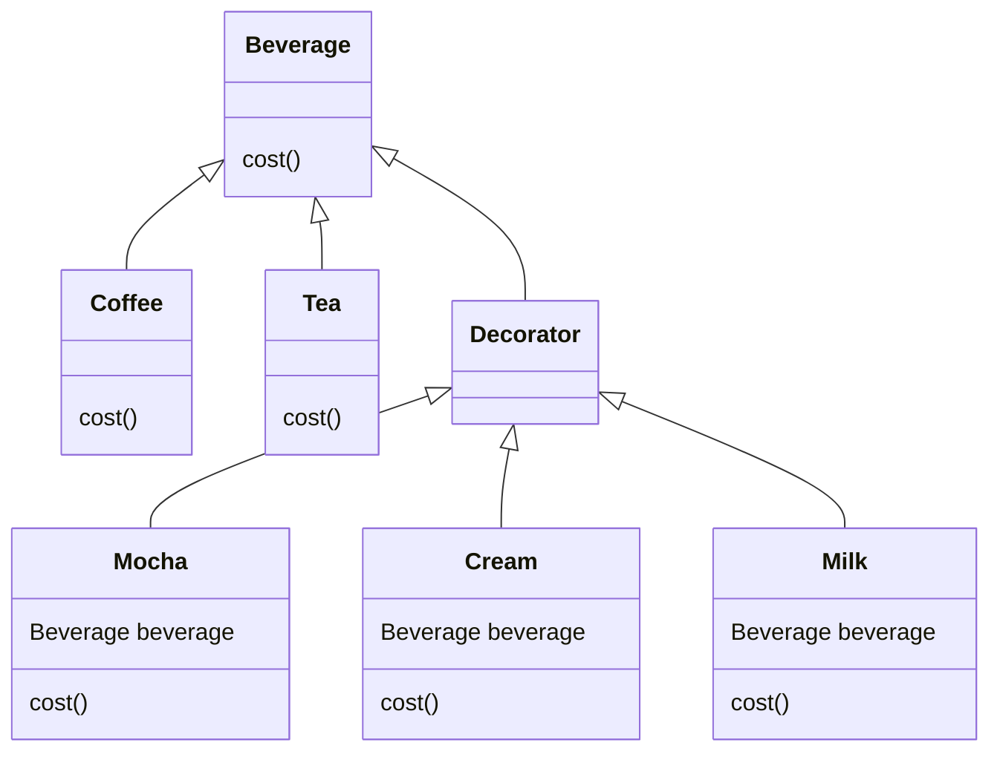

어떤 객체에 여러가지 변수들이 추가되어야 하는 경우 어떻게 해야할까?

예를 들어 카페의 음료 클래스가 있다고 가정해보자.

Beverage 추상 클래스로 시작되어서 Coffee, Tea 등 다양한 음료 객체가 만들어질 수 있겠다.

여기에서 각 음료들에 휘핑 크림이나 초콜릿, 우유 등을 추가할 수 있고, 각각의 재료가 추가될 때마다 음료의 가격이 올라가게 된다.

가장 간단하게 이를 구현하는 방법은, 모든 재료의 가지수만큼 클래스를 만드는 것이겠다.

WhipedCreamAndMilkCoffee, MochaIceTea 등등.. 새로운 음료 종류나 재료가 추가된다면 클래스는 무수하게 많아지게 된다.

이러한 문제를 해결하기 위해서, 데코레이터 패턴을 도입할 수 있다.

각각의 음료들에 추가되는 재료들을 “장식”이라고 표현하고, 음료객체를 재료객체로 감싸게 되는 것이다.

예를 들면 다음과 같다.

```
모카 객체 [
    크림 객체 (
        커피 객체
    )
]
```

위와같이 구현하기 위해서는, 마지막 음료 객체를 제외한 모든 장식 객체 안에 “음료”타입의 인스턴스 변수를 가지고 있어야 한다.

만약 위 음료의 가격을 알기 위해서는, 가장 외부의 객체의 cost()메서드를 호출하면 되는데 이 메서드는 차례로 자기가 가지고 있는 “음료”타입의 인스턴스의 cost를 호출한 뒤, 자기의 가격을 더하여 반환해준다.

클래스 다이어그램은 다음과 같이 구성된다.



사용법 예시

```java
Beverage beverage = new Coffee();
beverage = new Mocha(beverage);  // 위에서 만든 Coffee 객체를 Mocha 객체로 감쌌다.
beverage = new Cream(beverage);  // Coffee를 감싼 Mocha를 감싼 Cream 객체

// Cream -> Mocha -> Coffee 순으로 cost()를 호출하여 나온 결과값을
// 자기 자신의 가격에 더하여 반환한다.
System.out.println(beverage.cost()); 
```

Decorator 패턴의 예시는 java.io 패키지의 `FileInputStream` 클래스가 있다.

BufferedInputStream 클래스가 `FileInputStream` 를 감싸, 버퍼 기능을 추가하여 성능을 개선시키고,

LineNumberInputStream 클래스가 BufferedInputStream을 감싸, 데이터를 읽을 때 행 번호를 붙여주는 기능을 추가하였다.

Decorator 패턴을 사용하면 디자인이 유연해지는 장점이 있지만, 자잘한 클래스가 많이 추가되는 단점이 있다.

또한 특정 형식에 의존하는 코드에 데코레이터 패턴을 적용하면 문제가 있다는 점도 있다. (데코레이터 객체 안쪽에 있는 구상 구성요소를 바탕으로 돌아가는 코드의 경우 맞지 않다. 예를 들어 커피만 특별 할인을 한다던가 할 경우, 데코레이터 객체의 cost() 메서드로는 알기 힘들다.)

또한 데코레이터를 도입하면 구성 요소를 초기화하는테 필요한 코드가 훨씬 복잡해진다는 단점이 있다. (객체 안에 구성요소를 전부 넣기 위해서는 꽤 많은 구성요소를 감싸야 할 수도 있기 때문이다.)

하지만 이 단점은 추후 알아볼 팩토리나 빌더 패턴을 사용하면 개선이 가능하다고 한다.