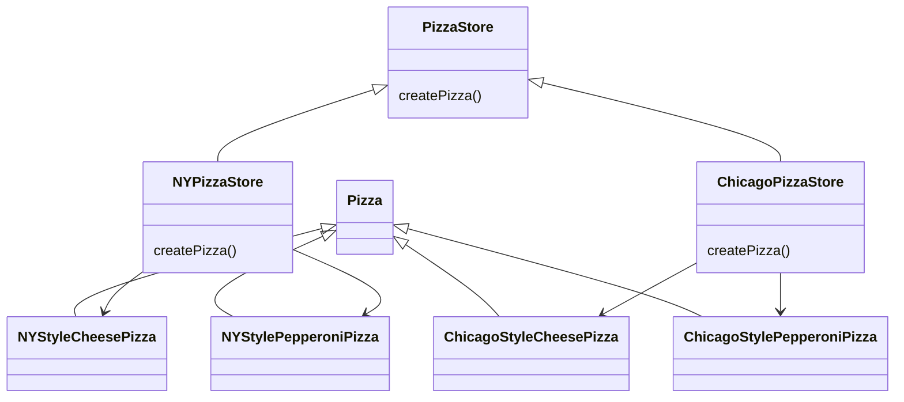
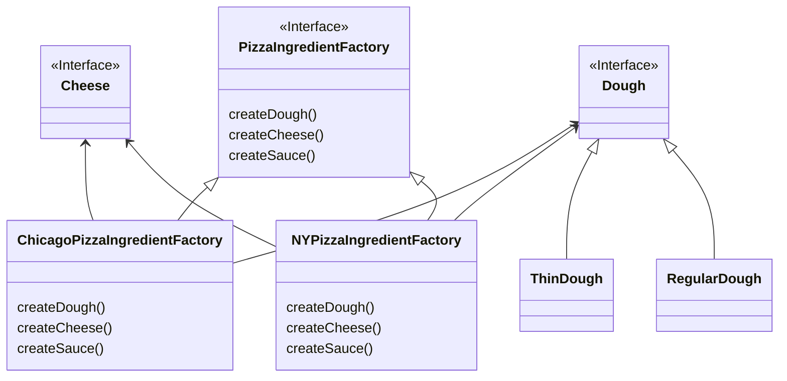

## 구상 클래스 생성 캡슐화

피자 가게 클래스에는 여러가지 피자 객체를 직접 생성하는 클래스가 있다.

```java
Pizza orderPizza(String type) {

	Pizza pizza;
	
	if (type.equals("cheese")) {
		pizza = new CheesePizza();
	} else if (type.equals("greek")) {
		pizza = new GreekPizza();
	} else if (type.equals("pepperoni")) {
		pizza = new PapperoniPizza();
	}
	
	pizza.bake();
	pizza.box();
	return pizza;
}
```

이 클래스의 문제점은, 피자 구상 클래스의 종류가 늘어날 때마다 코드를 수정해주어야 하는 부분이다.

피자 구상 클래스를 만들어주는 팩토리 클래스를 만들어보자.

```java
public class SimplePizzaFactory {

	public Pizza createPizza(String type) {
		Pizza pizza;
	
		if (type.equals("cheese")) {
			pizza = new CheesePizza();
		} else if (type.equals("greek")) {
			pizza = new GreekPizza();
		} else if (type.equals("pepperoni")) {
			pizza = new PapperoniPizza();
		}
		return pizza;
	}
}
```

```java
Pizza orderPizza(String type) {

	Pizza pizza = new SimplePizzaFactory().createPizza(type);
	
	pizza.bake();
	pizza.box();
	return pizza;

```

이렇게 할 경우 피자 객체를 생성하는 모든 코드에서 피자 종류가 늘어나더라도 수정해야 할 필요가 없어지게 된다.

## 팩토리 메서드

여러 종류의 피자 가게 (뉴욕 스타일, 시카고 스타일 등등)이 있을 경우, 각 피자 가게별로 조금씩 다른 차이점을 어떤 식으로 적용해야 할까?

위에서 만든 SimplePizzaFactory를 빼고 서로 다른 피자 팩토리 클래스를 만들어서 피자 가게 클래스에 주입시켜주면 되지 않을까?

```java
NYPizzaFactory nyFactory = new NYPizzaFactory();
PizzaStore nyStore = new PizzaStore(nyFactory);
nyStore.orderPizza("cheese");
```

다음과 같은 방법도 사용할 수 있다.

피자 팩토리와 피자 스토어를 하나로 묶고, 공통 로직을 넣은 후, 피자 생성 부분만 구현하도록 하는 것이다.

```java
public abstract class PizzaStore {

	Pizza orderPizza(String type) {
	
		Pizza pizza = createPizza();
		
		pizza.bake();
		pizza.box();
		return pizza;
	}
	
	abstract Pizza createPizza(String type);
}
```

피자 가게 추상 클래스 안에 createPizza 추상 메서드를 만들고, 각 피자 분점 구상 클래스에서 해당 메서드를 구현하는 방식이다.

```java
public class NYPizzaStore extends PizzaStore {
	Pizza createPizza(String item) {

		if (item.equals("cheese")) {
			return new NYStyleCheesePizza();
		} else if (item.equals("greek")) {
			return new NYStyleGreekPizza();
		} else if (item.equals("pepperoni")) {
			return new NYStylePapperoniPizza();
		} else {
			return null;
		}
	}
}
```

위와 같은 방식을 팩토리 메서드 패턴이라고 한다.

팩토리 메서드는 객체 생성을 처리하고, 팩토리 메서드를 이용하면 객체를 생성하는 작업을 서브클래스에 캡슐화 시킬 수 있다.

이렇게 하면 슈퍼 클래스에 있는 클라이언트 코드와 서브 클래스에 있는 객체 생성 코드를 분리할 수 있게 된다.

## 의존성 역전

이제 PizzaStore 클래스는 추상클래스인 Pizza 클래스에만 의존하게 된다.

구상 피자 클래스 또한 Pizza 추상 클래스의 의존하기 때문에, 의존성이 Pizza 추상 클래스로 흐르는 것을 볼 수 있다.

고수준 구성 요소(PizzaStore)가 저수준 구성 요소(피자 구상 클래스들)에 의존하면 안된다는 의존성 역전의 원칙을 지켰다고 볼 수 있다.

## 추상 팩토리

위의 피자 구상 클래스들에 원재료 변수가 추가되었다고 가정하고 구현해본다.

먼저 각 원재료의 팩토리를 먼저 구현해보자.

```java
public interface PizzaIngredientFactory {
	public Dough createDough();
	public sauce createSauce();
	public cheese createCheese();
}
```

```java
public NYStylePizzaIngredientFactory implements PizzaIngredientFactory {
	public Dough createDough() {
		return new ThinDough();
	}
	
	public sauce createSauce() {
		return new TomatoSauce();
	}
	
	public cheese createCheese() {
		return new ReggianoCheese();
	}
}
```

또한 피자 추상 클래스에도 원재료를 가지고 있도록 바뀌어야 한다.

```java
public abstract class Pizza {
	Dough dough;
	Sauce sauce;
	Cheese cheese;
	
	abstract void prepare();
	
	//...
}
```

피자 구상 클래스 내에서 위의 피자 원재료 팩토리 클래스를 주입받는다.

이후 prepare 메서드에서 재료들을 생성하여 인스턴스 변수에 저장한다.

```java
public class CheesePizza extends Pizza (

	PizzaIngredientFactory ingredientFactory;
	
	public CheesePizza (PizzaIngredientFactory ingredientFactory) {
		this.ingredientFactory = ingredientFactory:
	
	}
	void prepare() {
		System. out.println("Preparing " + name);
		dough = ingredientFactory.createDough();
		sauce = ingredientFactory.createSauce();
		cheese = ingredientFactory.createCheese();
	}
}
```

이제 피자 가게 클래스에서, 피자를 생성할 때, 원재료 생산 팩토리 클래스만 바꾸어서, 피자 클래스에 주입해주면 된다.

```java
public class NYPizzaStore extends PizzaStore {
	protected Pizza createPizza(String item) {

		PizzaIngredientFactory ingredientFactory = 
				new NYPizzaIngredientFactory();
		
		if (item.equals("cheese")) {
			return new CheesePizza(ingredientFactory);
		} else if (item.equals("greek")) {
			return new GreekPizza(ingredientFactory);
		} else if (item.equals("pepperoni")) {
			return new PapperoniPizza(ingredientFactory);
		} else {
			return null;
		}
	}
}
```

이전에 NYStyleCheesePizza와 같이 지역 이름이 붙은 구상 클래스가 존재했었는데, 각 지역별로 원재료가 다르다는 것을 빼면 차이점이 없기 때문에, 통일할 수 있게 되었다.

## 추상 팩토리와 팩토리 메서드

위와 같이 클라이언트와 생산되는 제품을 분리하는 방식의 패턴을 추상 팩토리라고 한다.

실제 구상 팩토리 클래스는 추상 팩토리를 구현하고, 클라이언트는 그 추상 팩토리 클래스로부터 제품(객체)를 생성받는 방식이다.

추상 팩토리 패턴에서는 메서드가 팩토리 메서드로 구현되는 경우도 종종 있다.

추상 팩토리가 원래 일련의 객체를 생성하는데 쓰일 인터페이스를 구현하기 위해서 만들어진 것이기 때문이다.

그 인터페이스에 있는 각 메서드는 구상 객체를 생성하는 일을 맡고 있고, 추상 팩토리의 서브 클래스를 만들어서 각 메서드의 구현을 제공한다.

두 패턴 모두 객체를 생성하는데 사용하는 패턴이다.

둘의 차이점은, 팩토리 메서드 패턴의 경우 상속을 통해 객체를 만든다는 점이고, 추상 팩터리는 객체 구성 (Composition)을 통해 만든다는 점이다.

추상 팩터리의 단점으로는 생산하는 제품군에 제품(위의 예시에서 원재료)이 추가되거나 할 경우에는 인터페이스를 바꿔야 한다는 점이 있다.

보통 추상 팩토리는 꽤 많은 제품이 들어있는 제품군을 생성하기 때문에 인터페이스도 크다.

팩토리 메서드 패턴은 보통 한 가지 제품만 생산해 간단하다.

팩토리 메서드 패턴



추상 팩터리 패턴

