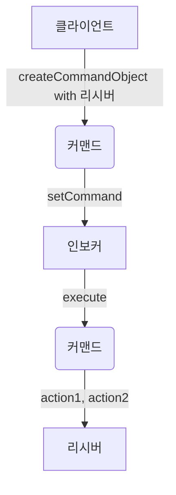
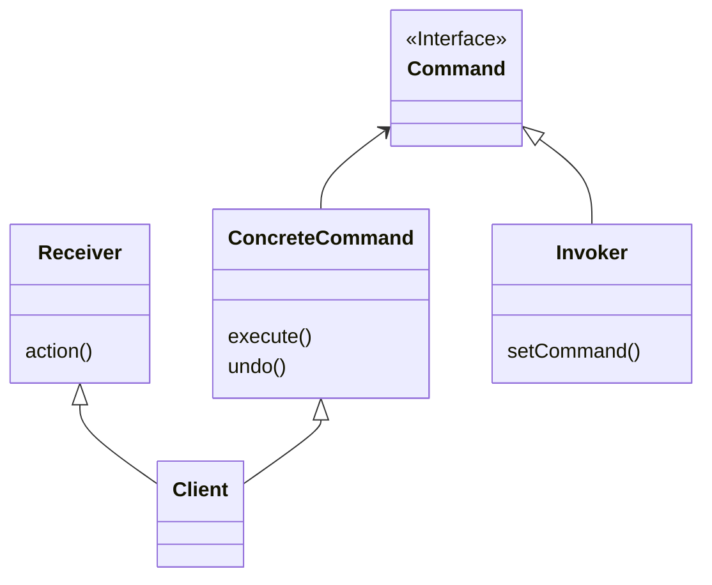

- 클라이언트는 커맨드 객체를 생성한다.
    - 커맨드 객체는 execute()라는 메서드만 존재하는 인터페이스를 구현한다.
    - 내부 변수로 리시버 객체를 갖는다.
- 클라이언트에서 인보커 객체의 setCommand() 메서드를 호출하는데, 이 때 커맨드 객체를 넘겨준다.
- 인보커에서 커맨드 객체의 execute() 메서드를 호출한다.
- 리시버에 있는 특정 행동을 하는 메서드가 호출된다.

예를 들어, 어떤 리모컨이 있고 그 리모컨에 전등을 등록하여 전등의 특정 기능(전등 켜기)를 실행시키는 커맨드 패턴을 구현해보겠다.

```java
// 커맨드 인터페이스
public interface Command {
	public void execute();
}
```

```java
// 전등 켜기 명령을 담고있는 커맨드 클래스 구현
public class LightOnCommand implements Command {

	// 실제 행동을 가지고 있는 리시버 객체를 변수로 선언
	Light light;
	
	public LightOnCommand(Light light) {
		this.light = light;
	}
	
	@override
	public void execute() {
		light.on();
	}
}
```

```java
// 커맨드 객체 사용해보기
public class SimpleRemoteControl {
	Command command
	
	public SimpleRemoteControl() {}
	
	public void setCommand(Command command) {
		this.command = command;
	}
	
	public void buttonWasPressed() {
		command.execute();
	}
}
```

이렇게 커맨드 패턴을 사용하면 여러 요구 사항들을 객체로 캡슐화 할 수 있다.

뿐만 아니라 요청 내역을 큐에 저장하거나, 로그로 기록하는 등의 다양한 작업도 가능하다.

클래스 다이어그램

