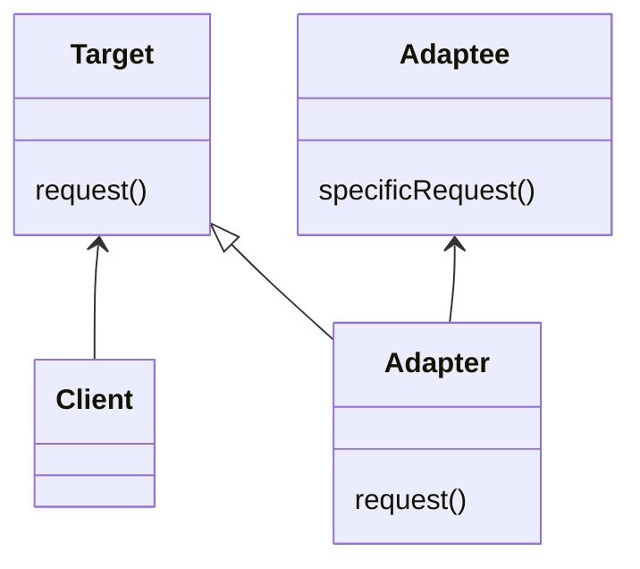

## 어댑터 패턴

어댑터 패턴은 호환성이 맞지 않는 두 클래스들을 연결해주는 패턴을 의미한다.

예를 들어 유럽식 전원 소켓에 한국식 플러그를 꽂기 위해서는 두 인터페이스를 연결해주는 어댑터가 필요한 것과 비슷하다.

소프트웨어를 개발하다 보면, 다른 곳에서 개발하여 넘겨준 클래스와, 오랫동안 개발되어 수정할 수 없는 기존 클래스를 연결해야 하지만 두 클래스의 호환성이 맞지 않는 경우가 종종 발생한다.

이러한 경우 두 클래스를 연결해주는 어댑터 클래스를 추가하여 연결해주는 방식이 어댑터 패턴이다.

```java
// 기존에 개발되어 수정할 수 없는 코드
public class Client {
	@Override
	public void request(Target target) {
		target.request();
	}
}
```

```java
public interface Target {
	void request();
}
```

위와 같이 기존에 개발된 클라이언트 측 코드가 있다고 가정해보자.

Target 인터페이스를 타입으로하는 객체를 매개변수로 받아 request() 메서드를 호출하는 코드이다.

하지만 다른 업체에서 Adaptee 인터페이스를 구현한 클래스를 보내주었고, 해당 클래스와 위 코드의 request 메서드의 매개변수로 입력해야 한다면 어떻게 해야 할까?

두 코드는 모두 수정할 수 없다.

```java
public class AdapteeImpl implements Adaptee {
	@Override
	public void specificRequest() {
		...;
	}
}
```

이 때 Adapter 패턴을 적용하여 문제를 해결할 수 있다.

Adapter 클래스를 만든 뒤 Target 인터페이스를 구현한다.

Adapter 클래스 안에는 Adaptee 인터페이스를 타입으로 하는 객체를 변수로 담고 있다. (객체 구성 (Composition) 사용)

이후 Target 인터페이스를 구현하고 request() 메서드 안에서는 변수로 가지고 있는 adaptee 객체의 specificRequest()를 호출해주기만 하면 된다.

```java
public class Adapter implements Target {
	private final Adaptee adaptee;
	
	public Adapter(Adaptee adaptee) {
		this.adaptee = adaptee;
	}
	
	@Override
	public void request() {
		this.adaptee.specificRequest();
	}
}
```

클래스 다이어그램으로 나타내면 다음과 같다.



어댑터 패턴은 크게 두 종류가 있다.

지금까지 알아본 것은 객체 어댑터 이고, 다른 하나는 클래스 어댑터이다.

클래스 어댑터 패턴을 쓰려면 다중 상속이 필요한데, 자바에서는 다중 상속을 지원하지 않기 때문에 잘 사용되지 않는 패턴이다.