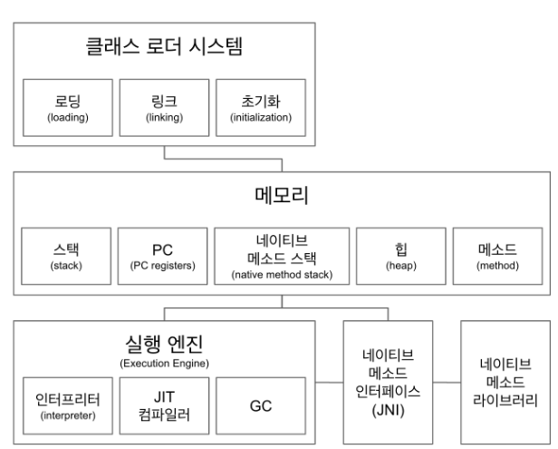

- 목차

## [강의 문서](https://docs.google.com/document/d/11zgALhqn3igwfs4xc9cYdRPlyS84M6ba_6xz0I2M-Ik/edit?usp=sharing)

## 개요

[백기선 - 더 자바 코드를 조작하는 다양한 방법](https://www.inflearn.com/course/the-java-code-manipulation/dashboard)을 들으며 내용 정리

## 자바 환경 간단정리

### JVM

자바 가상머신, 자바 바이트 코드(class)파일을 OS상에서 실행시킴.

class 파일을 메모리에 적재함.

OS에 특화된 코드로 변환하기 때문에 플랫폼에 종속적이다.

JVM 벤더(오라클, 아마존 ..)마다 구현이 다를 수 있음. 스펙은 오라클에서 지정한다.

### JRE

java 애플리케이션을 실행시키기만 하는 환경

JVM, Library를 포함한다.

자바 11부터는 JRE만을 따로 제공하지는 않음. JDK를 받아야 한다.

### JDK

java를 개발하기 위한 툴.

JRE를 포함하여 Javac(컴파일러) 등 개발에 필요한 환경들이 제공됨.

### JAVA

프로그래밍 언어.

JDK에 들어있는 javac를 이용하여 바이트코드로 컴파일될 수 있다.

프로그래밍 언어일 뿐 JDK, JVM등을 뭉뚱그려 한꺼번에 자바라고 표현하는것은 잘못 표현하는 것일수 있음.

## JVM 구조



### 1. 클래스 로더 시스템

- 컴파일 되어있는 class파일들을 읽고 메모리에 적재
- Link : 레퍼런스를 읽어오는 과정
- static 값들을 초기화 한다.
    
    
    
- 로딩, 링크 초기화 순으로 진행됨.
- 로딩
    - 클래스 로더가 class 파일을 읽고 그 내용에 따라 적절한 바이너리 데이터를 만들고 `메소드`영역에 저장
    - 이때 메소드 영역에 저장되는 데이터
        - FQCN ( Fully Qualified Class Name 패키지 포함 클래스 이름)
        - 클래스 | 인터페이스 | 이넘
    - 로딩이 끝나면 해당 클래스 타입의 “Class” 객체를 생성하여 `힙` 영역에 저장된다.
- 링크
    - 검증 : class 파일 형식이 유효한지 체크
    - 클래스 변수(static)와 기본값에 필요한 메모리를 준비
    - Resolve: 심볼릭 메모리 레퍼런스를 메소드 영역에 있는 실제 레퍼런스로 교체한다.
- 초기화
    - 스태틱 변수의 값을 모두 할당한다.
- 클래스 로더 종류
    - 클래스 로더는 계층 구조로 이뤄져 있으면 기본적으로 세가지 클래스 로더가 제공된다.
        - 부트 스트랩 클래스 로더 - JAVA_HOME\lib에 있는 코어 자바 API를 제공한다. 최상위 우선순위를 가진 클래스 로더
        - 플랫폼 클래스로더 - JAVA_HOME\lib\ext 폴더 또는 java.ext.dirs 시스템 변수에 해당하는 위치에 있는 클래스를 읽는다.
        - 애플리케이션 클래스로더 - 애플리케이션 클래스패스(애플리케이션 실행할 때 주는 -classpath 옵션 또는 java.class.path 환경 변수의 값에 해당하는 위치)에서 클래스를 읽는다.

### 2. 메모리

- 메소드 영역에는 클래스 수준의 정보를 저장 ((풀패키지)클래스 이름, 부모 클래스 이름, 메소드 변수)
    - 다른 영역에서도 참조할 수 있는 공유된 공간
- 힙 영역에는 객체를 저장, 공유한다. (동적 자원)
- 스택, PC, 네이티브 메소드 스택 이 세가지 공간은 스레드에 국한되는 공간임
- 스레드를 생성하면 스택 프레임을 생성하는데, 메서드 호출 스택을 저장함.
- 이렇게 저장된 스택에서 어느 위치를 실행중인지를 가리키는 정보는 PC (Program Counter) 레지스터에 저장함
- 네이티브 메소드란 java가 아닌 다른 네이티브 언어로 구현된 메소드를 말함.
    - 네이티브 언어로 구현된 메소드는 네이티브 메소드 라이브러리에 저장되고, 스택이 메소드를 호출할 때 JNI를 통해서 받아옴.

### 3. 실행 엔진

- 인터프리터 : 바이트 (class)코드를 한 줄씩 실행함
- 반복되는 코드를 발견하면 JIT 컴파일러를 통해 네이티브 코드로 바꿔둔 후, 그 부분이 나오면 가져다 씀
- GC (가비지 컬렉터): 필요없는 객체를 모아서 정리함

## 바이트 코드

### 바이트 코드 조작 툴

- ASM
- Javassist
- ByteBuddy

### 바이트 코드 조작 툴 활용 예

**프로그램 분석**

- 코드에서 버그 찾는 툴
- 코드 복잡도 계산

**클래스파일 생성**

- 프록시
- 특정 API 호출 접근 제한
- 스칼라 같은 언어의 컴파일러

**그 밖에도 자바 소스코드 건드리지 않고 코드 변경이 필요한 여러 경우**

- 프로파일러(성능 측정 툴)
- 최적화
- 로깅

### 스프링이 컴포넌트 스캔을 하는 방법

- 컴포넌트 스캔으로 빈으로 등록할 후보 클래스 정보를 찾는데 사용
- ClassPathScanningCandidateComponentProvider → SImpleMetadataReader
- ClassReader의 Visitor을 사용해서 클래스의 메타 정보를 읽어온다.

## 리플렉션

### 리플렉션이란

구체적인 클래스 타입을 알지 못해도 그 클래스의 메소드, 타입, 변수들에 접근할 수 있도록 해주는 자바 API

### 클래스에 접근하는 방법

- 모든 클래스를 로딩하고 나면 Class`<T>`의 인스턴스가 힙에 적재된다. 타입.class로 접근할 수 있다.
- 모든 인스턴스는 getClass() 메소드를 가지고 있기 때문에, 인스턴스.getClass()로 접근할 수 있다.
- 클래스를 문자열로 읽어오는 방법
    - Class.forName(”FQCN”) , 클래스 경로에 클래스가 없으면 익셉션 발생

### Class`<T>`를 통해 할 수 있는 것

Declared가 붙은 메서드는 public이 아닌 것까지 가져오겠다는 의미임.

- 필드 (목록) 가져오기 getFields(), getDeclaredFields()
- 메소드 (목록) 가져오기 getMethods()
- 상위 클래스 가져오기 getSuperclass()
- 인터페이스 (목록) 가져오기 getInterfaces()
- 애노테이션 가져오기 getDeclaredAnnotations()
- 생성자 가져오기 getDeclaredConstructors()

### 어노테이션

어노테이션은 기본적으로 주석과 비슷하기 때문에, 소스코드와 클래스단에는 남아 있지만, 코드를 컴파일하고 나면 바이트코드에는 적재되지 않는다. 

런타임에서도 어노테이션을 확인하고 싶다면, 어노테이션 인터페이스에 `@Retention(RetentionPolicy.RUNTIME)` 옵션을 주어야 한다.

어노테이션을 붙일 수 있는 범위를 한정짓고 싶다면, `@Target({ElementType.Type})` 옵션을 준다.

어노테이션에 값을 넣어줘야 한다면, `String name()` 같이 메서드를 선언하고, 어노테이션에서 `@Annotation(name = “s4ng”)` 같이 입력받는다.

`Class.getAnnotations()`으로 어노테이션을 가져오게 되면, 직속 부모 클래스에 붙은 어노테이션도 모두 가져온다. 해당 클래스만 가져오려면  Declared를 붙인다.

리플렉션을 이용해서 값을 변경하고 싶다면 `Field a  = ClassName.class.getDeclaredField()` 로 필드를 가져온 후, `a.set(~)` 과 같은 방법으로 값을 변경할 수 있음.

### DI 실습

```java
// Inject 어노테이션 선언
@Retention(RetentionPolicy.Runtime)
public @interface Inject {}

// Inject 어노테이션으로 field 주입 예시
public class BookService {
	@Inject
	BookRepository bookRepository;
}

// getObject
public class ContainerService {

	public static `<T>` T getObject(Class`<T>` classType) {
		// classType.getConstructor로 인스턴스 생성
		T instance = createInstance(classType); 
		Arrays.stream(classType.getDeclaredField()).forEach(f -> {
			if(f.getAnnotation(Inject.class) != null) {
				Object fieldInstance = createInstance(f.getType());
				f.setAccessible(true);
				try {
					f.set(instance, fieldInstance);
				} catch (IllegalAccessException e) {
					throw new RuntimeException(e);
				}
			}	
		}
	}
}

// 새 프로젝트에서 위 프로젝트 사용
public class App {
	public static void main(String[] args) {
		AccountService accountService = ContainerService.getObject(AccountService.class);
	}
}
```

### 리플렉션 사용 시 주의점

1. 지나친 사용은 성능 이슈를 야기할 수 있다. 반드시 필요한 경우에만 사용.
2. 컴파일 타임에 확인되지 않고 런타임 시에만 발생하는 문제를 만들 가능성이 있다.
3. 접근 지시자를 무시할 수 있다.

## 다이나믹 프록시

### 프록시 패턴


- 프록시와 리얼 서브젝트가 공유하는 인터페이스가 있고, 클라이언트는 해당 인터페이스 타입으로 프록시를 사용한다.
- 클라이언트는 프록시를 거쳐서 리얼 서브젝트를 사용하기 때문에 프록시는 리얼 서브젝트에 대한 접근을 관리하거나, 부가기능을 제공하거나, 리턴값을 변경할 수도 있다.
- 리얼 서브젝트는 자신이 해야할 일만 하면서 프록시(단일 책임 원칙)를 사용해서 부가적인 기능(접근 제한, 로싱, 트랜잭션 등)을 제공할 때 이런 패턴을 주로 사용한다.

### 다이나믹 프록시

런타임에 특정 인터페이스들을 구현하는 클래스 또는 인스턴스를 만드는 기술

```java
// 다이나믹 프록시로 인터페이스를 구현해서 주입하는 예시
//            Proxy 클래스의 newProxyInstance로 BookService 인터페이스의 인스턴스 생성
BookService bookService = (BookService) Proxy.newProxyInstance(
		BookService.class.getClassLoader(), new Class[]{BookService.class},
		new InvocationHandler() {  
			// 인수로 받는 InvocationHandler로 메서드가 실행될 때 변경될 부분을 명시
			// 이 때, InvocationHandler 안에서 리얼 서브젝트 객체를 가지고 있음.
			BookService bookService = new DefaultBookService();
			@Override
			public Object invoke(Obejct proxy, Method method, Object[] args) throws Throwable {
				// invoke 메서드 안에서 프록시의 역할을 구현함		
				if(method.getName().equals("methodName")) {				
					System.out.println("additional text");
					Object invoke = method.invoke(bookService, args);			
					return invoke;
				}				
				
				return method.invoke(bookService.args);
			}
		});
```

이 `InvocationHandler`로 프록시를 구현하게 되면, 프록시 객체를 매번 생성할 필요는 없어지지만, `InvocationHandler` 자체가 유연하지 못하고, 또 기능을 추가하다 보면 코드가 계속해서 길어질 우려가 있음.

이러한 문제점을 개선하기 위해 스프링에서 고쳐낸 기능이 `Spring AOP` 이다.

또 자바의 다이나믹 프록시는 꼭 인터페이스여야 한다. 클래스의 프록시를 생성할 수 없다.

만약 클래스일 때 동적으로 프록시를 만드는 방법이 있다.

### 클래스로 다이나믹 프록시를 적용하는 방법

**CGlib을 이용한 방법**

```java
MethodInterceptor handler = new MethodInteceptor() {
	BookService bookService = new BookService();
	@Override
	public Object intercept(Object o, Method methodm Object[] args, 
													MethodProxy methodProxy) throws Throwable {
			if(method.getName().equals("methodName")) {				
				System.out.println("additional text");
				Object invoke = method.invoke(bookService, args);			
				return invoke;
			}				
			
			return method.invoke(bookService.args);
	}
};
BookService bookService = (BookService) Enhancer.create(BookService.class, handler);
```

- CGlib의 Enhancer라는 클래스를 이용해서 해결할 수 있다.
- 스프링, 하이버네이트가 사용하는 라이브러리
- 버전 호환성이 좋치 않아서 서로 다른 라이브러리 내부에 내장된 형태로 제공되기도 한다.

**ByteBuddy**를 이용한 방법

```java
Class<? extends BookService> proxyClass = new ByteBuddy().subclass(BookService.class)
		.method(named("methodName")).intercept(InvocationHandlerAdapter.of(new InvocationHandler() {
			BookService bookService = new BookService();
			@Override
			public Object invoke(Object proxy, Method method, Object[] args) throws Throwable {
				return method.invoke(bookService, args);
			}
		}))
		.make().load(BookService.class.getClassLoader()).getLoader();
BookService bookService = proxyClass.getConstructor(null).newInstance();
```

**서브 클래스를 만드는 방법의 단점**

- 상속을 사용하지 못하는 경우 프록시를 만들 수 없다.
    - Private 생성자만 있는 경우
    - Final 클래스인 경우
- 인터페이스가 있을 때는 인터페이스의 프록시를 만들어 사용할 것.

### 다이나믹 프록시의 사용처

- 스프링 데이터 JPA
- 스프링 AOP
- Mockito
- 하이버네이트 lazy initialization

## 어노테이션 프로세서

### 롬븍의 동작 원리

- 컴파일 시점에 어노테이션 프로세서를 사용해서 소스코드의 AST(Abstract syntax tree)를 조작한다.

### 논란

- 공개된 API가 아닌 컴파일러 내부 클래스를 사용하여 기존 소스 코드를 조작한다.
- 특히 이클립스의 경우엔 java agent를 사용하여 컴파일러 클래스까지 조작하여 사용한다. 해당 클래스들 역시 공개된 API가 아니다보니 버전 호환성에 문제가 생길 수 있고 언제라도 그런 문제가 발생해도 이상하지 않다.
- 그럼에도 불구하고 엄청난 편리함 때문에 널리 쓰이고 있으며 대안이 몇가지 있지만 롬복의 모든 기능과 편의성을 대체하진 못하는 현실이다.
    - AutoValue
    - Immutables

### 어노테이션 프로세서 구현하기

1. `@Retention(RetentionPolicy.Source)` 를 가지고 있는 어노테이션을 선언한다.
2. 굳이 바이트코드 까지 어노테이션을 유지시킬 필요가 없기 때문에.
3. 해당 어노테이션으로 프로세싱을 진행할 클래스를 선언하고 추상 클래스인`AbstractProcessor` 를 구현한다. 클래스 이름은 `MagicProcessor` 로 지정하겠음. (`Processor` 인터페이스를 구현해도 됨.)
4. 클래스 안에 어떤 어노테이션을 프로세싱할지 명시한다. 여기서는 `@Magic` 어노테이션으로 선언한다.
    
    ```java
    public Set<String> getSupportedAnnotationTypes() {
    	return Set.of(Magic.class.getName());
    }
    ```
    
5. 그 다음 `process` 메서드를 구현한다.
    
    ```java
    @Override
    public boolean process(Set<? extends TypeElement> annotations, RoundEnvironment roundEnv) {
        Set<? extends Element> elements = roundEnv.getElementsAnnotatedWith(Magic.class);
        for (Element element : elements) {
            Name elementName = element.getSimpleName();
    				// interface 타입이 아니면 에러
            if (element.getKind() != ElementKind.INTERFACE) {
                processingEnv.getMessager().printMessage(Diagnostic.Kind.ERROR, "Magic annotation can not be used on " + elementName);
            } else {
                processingEnv.getMessager().printMessage(Diagnostic.Kind.NOTE, "Processing " + elementName);
            }
    
            TypeElement typeElement = (TypeElement)element;
            ClassName className = ClassName.get(typeElement);
    				// 메소드 생성
            MethodSpec pullOut = MethodSpec.methodBuilder("pullOut")
                    .addModifiers(Modifier.PUBLIC)
                    .returns(String.class)
                    .addStatement("return $S", "Rabbit!")
                    .build();
    				// 타입(클래스) 생성, classBuilder안에는 클래스 이름만 넣어도 됨.
            TypeSpec magicMoja = TypeSpec.classBuilder("MagicMoja")
                    .addModifiers(Modifier.PUBLIC)
                    .addSuperinterface(className)
                    .addMethod(pullOut)
                    .build();
    				// 어노테이션 프로세서에서 제공하는 filer
            Filer filer = processingEnv.getFiler();
            try {
    						// 실제로 바이트코드를 생성하는 코드 (javapoet 사용)
                JavaFile.builder(className.packageName(), magicMoja)
                        .build()
                        .writeTo(filer);
            } catch (IOException e) {
                processingEnv.getMessager().printMessage(Diagnostic.Kind.ERROR, "FATAL ERROR: " + e);
            }
        }
        return true;
    }
    ```
    
6. 이후 `src/main/resources/META-INF/services` 경로에 `javax.annotation.processing.Processor` 파일을 생성 후 아까 만든 `MagicProcessor` 의 패키지 경로를 복사해서 입력한다.
    
    ```java
    // 예시
    com.s4ng.MagicProcessor
    ```
    
- 6번을 수행하는 것이 너무 번거롭기 때문에 생긴 라이브러리가 있는데 그것이 `AutoService` 이다.
- 해당 라이브러리를 사용하지 않고 6번을 수행하게 되면, 바이트 코드가 없는 상태에서 빌드하는데에 문제가 있어서, 예시 부분을 주석처리한 후 clean build하고나서 다시 빌드해야 하는 불편한 점이 있다.
- `AutoService`를 사용하면 컴파일과 동시에 6번 파일이 생성되기 때문에 빌드하는데 별다른 문제점이 생기지 않는다.
- 사용법은 Dependency 등록 후에 `MagicProcessor` 클래스에 `@AutoService(Processor.class)` 어노테이션을 추가하면 된다.

### 어노테이션 프로세서 사용 예

- 롬복
- AuthService : java.util.
- @Override
- Dagger2: 컴파일 타임에 DI 제공

### 어노테이션 프로세서의 장점

- 런타임 비용이 없다.
    - 컴파일을 할 때 모든 프로세싱이 완료되기 때문에.

### 끝

---